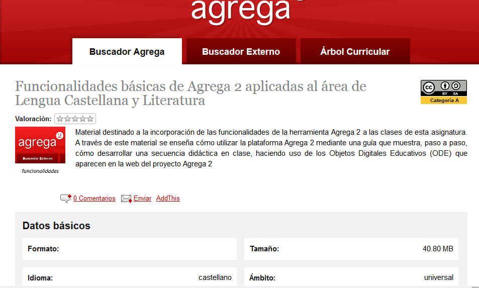
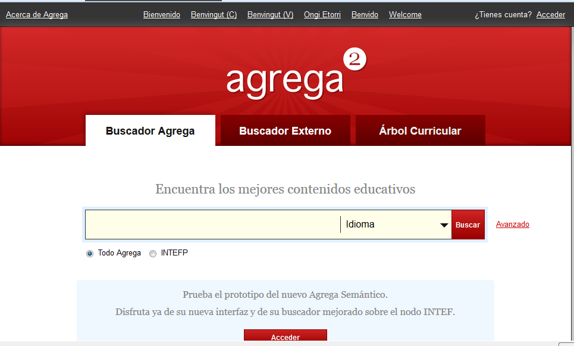

# Agrega

**Repositorio educativo  Agrega2** ([http://www.agrega2.es](http://www.agrega2.es))

El proyecto Agrega2 es una plataforma tecnológica implantada en las administraciones educativas españolas, a través de nodos autonómicos interconectados entre sí (federación de repositorios de objetos digitales educativos Agrega), para facilitar a la comunidad educativa un repositorio de contenidos digitales curriculares en línea. 

Uno de sus apartados contiene **Materiales para uso curricular** muy interesantes para los profesores de Lengua castellana y Literatura:

*   [Panorámica general Agrega2](http://agrega.educacion.es/ODE2/es/es_2013051412_9122640/embed "Enlace a ventana nueva")
    
*   [Agrega2 Metodologías Integración curricular TIC](http://agrega.educacion.es/ODE2/es/es_2013051412_9123601/embed "Enlace a ventana nueva")
    
*   [Funcionalidades básicas Lengua](http://agrega.educacion.es/ODE2/es/es_2013051412_9115643/embed "Enlace a ventana nueva")
    
*   [Funcionalidades medias Lengua](http://agrega.educacion.es/ODE2/es/es_2013051412_9111950/embed "Enlace a ventana nueva")
    

Fig. 2.19  _Página de Funcionalidades básicas de lengua en agrega2_

En esta página encontramos material destinado para  la incorporación de las funcionalidades de la herramienta Agrega 2 en las clases de Lengua castellana y Literatura. A través de este material, se enseña a utilizar la plataforma Agrega2 mediante una guía que muestra, paso a paso, cómo desarrollar una secuencia didáctica en clase, haciendo uso de los Objetos Digitales Educativos (ODE) que aparecen en la web del proyecto Agrega2. Hay distintos tipos de búsqueda que aparecen cuando hemos entrado en Funcionalidades básicas de Lengua.

  Fig. 2.20  _Búsqueda en Agrega_

Seleccionamos una de ellas, la que más te va a dejar aproximarte a lo que quieres es Árbol Curricular, eliges el ODE y lo embebes en tu blog o lo descargas.

