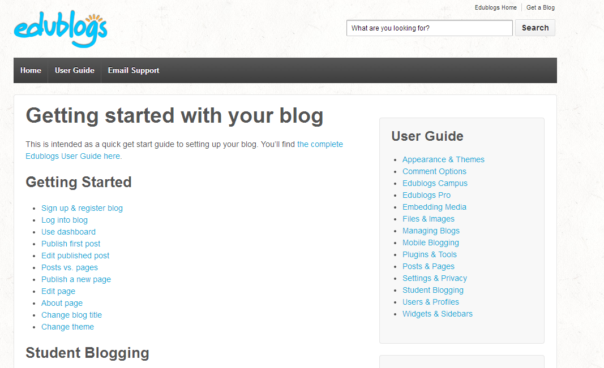
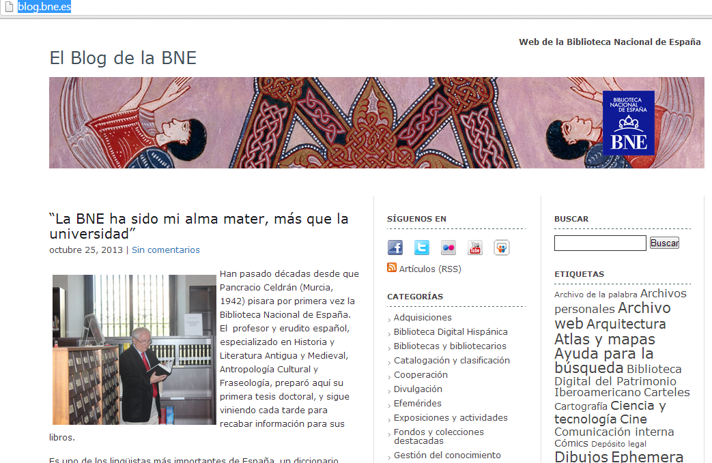
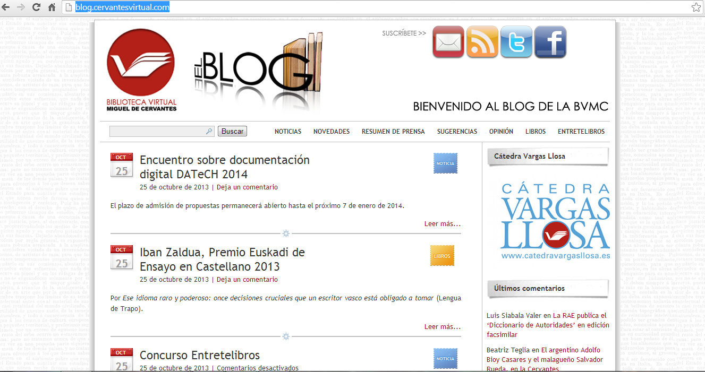

# Ampliación de contenidos

## ParaSaberMas

**A continuación te presentamos otras posibilidades  para crear tu blog**

*    Para crear un blog con **edublogs** (tutorial en inglés) 

                      [http://help.edublogs.org/getting-started-with-edublogs](http://help.edublogs.org/getting-started-with-edublogs)

 

Fig. 1.21 _ Página inicial de edublog_

*   Para montar un blog en tu espacio con wordpress.org

[http://blog.educastur.es/hosting/category/ayuda-y-tutoriales/serv-de-hospedaje/](http://blog.educastur.es/hosting/category/ayuda-y-tutoriales/serv-de-hospedaje/)

 **Direcciones de blogs institucionales**

*   Blog de la Biblioteca Nacional [http://blog.bne.es/](http://blog.bne.es/)

 

 Fig. 1.22  _Blog de la Biblioteca nacional_

*   Blog de la Biblioteca Virtual Miguel de Cervantes [http://blog.cervantesvirtual.com/](http://blog.cervantesvirtual.com/)

Fig. 1.23  _Blog de la Biblioteca Virtual Miguel de Cervantes_

*   Blog del Centro Virtual Cervantes [http://ese.blogs.cervantes.es/](http://ese.blogs.cervantes.es/)

