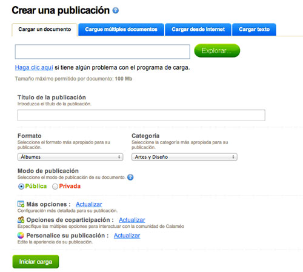

# Ampliación de contenidos

## ParaSaberMas

Otro servicio para compartir documentos en la red es Calaméo ([http://es.calameo.com/](http://es.calameo.com/)) que permite subir documentos PDF, DOC, PPT y archivos de OpenOffice, y también crear textos _online_. Su uso es muy sencillo, los trabajos se publican en la red a través de una URL y el código de embebido. Se pueden activar para que sean descargadas por nuestros alumnos.

 

**Cómo utilizarla**

Primero hay que entrar en la web [Calaméo](http://es.calameo.com/) y nos registramos de forma gratuita, creando una cuenta de usuario. Una vez dentro de la aplicación, podemos comenzar a utilizar la herramienta haciendo clic en el botón azul "**crear una publicación**" y veremos las cuatro opciones posibles: **Cargar un documento, cargar múltiples documentos, cargar documento de internet y cargar texto** (que se escribe _online_). Una vez seleccionada la opción que nos interesa, continuamos poniendo el título, configurando la privacidad y otras opciones avanzadas.

****

 

**Utilidades didácticas**

*   Compartir documentos para que los alumnos los utilicen como consulta: apuntes, ejercicios, comentarios de texto, explicaciones de actividades, etc.
*   Compartir trabajos de los alumnos, publicar revistas educativas, alojar calendarios de actividades de clase, publicar escritos, cuentos, avisos, etc. 
*   Crear textos _online_ sobre apuntes de clase, actividades, tareas, instrucciones para trabajos, etc., para tenerlas en la red automáticamente.

Información obtenida de [http://www.educacontic.es/blog/calameo-comparte-tus-apuntes-y-documentos-en-la-red](http://www.educacontic.es/blog/calameo-comparte-tus-apuntes-y-documentos-en-la-red)

