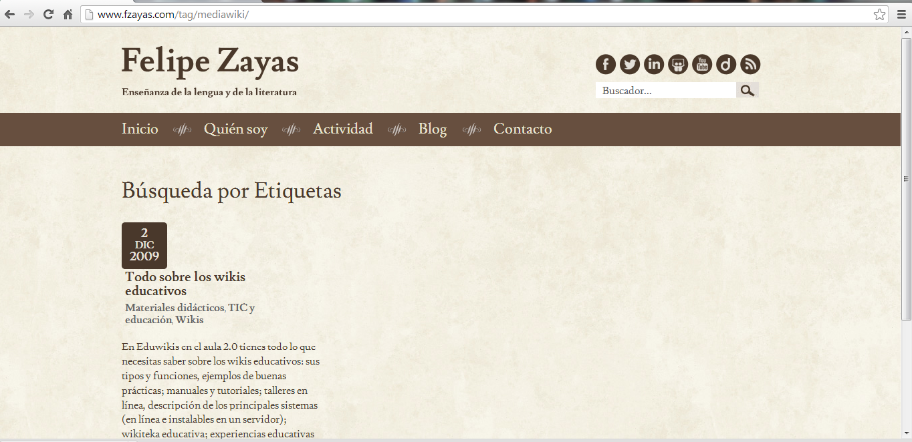

# Ampliación de contenidos

## ParaSaberMas

**Elegir tu wiki**

Existen en la red una gran cantidad de sitios donde puedes crear tu wiki de forma sencilla y gratuita. Para elegir el sitio que mejor se ajuste a tus intereses, puedes utilizar la matriz de [comparación de wikis](http://www.wikimatrix.org/),que te permite comparar las características de los wikis.

**Otros  gestores de contenidos** especializados en la creación y administración de wikis.

*   [PBWorks](http://pbworks.com/) (en línea, anteriormente PBWiki)

Vídeo 7 [Tutorial Pbworks](https://www.slideshare.net/marianal_TIC/tutorial-pbworks "Tutorial Pbworks")  de  [marianal_TIC](http://www.slideshare.net/marianal_TIC)

*   [MediaWiki](http://www.mediawiki.org/wiki/MediaWiki/es) (software descargable  utilizado por Wikipedia)

Fig. 4.11  _Herramienta creada con Media Wiki_

*   [Twiki](http://www.twiki.org/) (software descargable)
*   [Instiki](http://www.instiki.org/) (software descargable)

 **Más experiencias educativas de wikis colaborativas**

Vídeo 6.   [Ponencia wikis educativos3](https://www.slideshare.net/montsegomezmoya/ponencia-wikis-educativos3 "Ponencia wikis educativos3")  de [Montse Gómez Moya](http://www.slideshare.net/montsegomezmoya)

