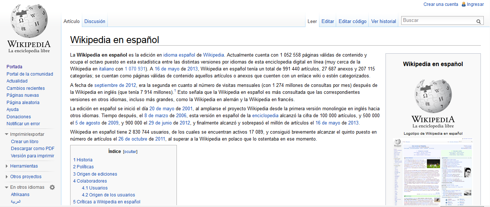

# Archive.org y los wikis

**Otro recurso** del que se pueden extraer textos, y otros recursos multimedia, es [https://archive.org/](https://archive.org/). Es un sitio web y una organización sin ánimo de lucro destinada a la preservación de historiales Web y recursos multimedia.  Tiene una gran cantidad de archivos de audio, video y texto, algunos de ellos en dominio público, o de licencias  Creative Commons o cualquier otra licencia que permita la distribución. 

  

Fig. 2.9 _Federico García Lorca, Romancero Gitano_

         [http://www.archive.org/stream/romancerogitano100garcuoft#page/4/mode/2up](http://www.archive.org/stream/romancerogitano100garcuoft#page/4/mode/2up)

**2\. Los wikis**

** Wikipedia**

Una de las opciones más interesantes cuando se necesita contenido textual es la Wikipedia [http://es.wikipedia.org](http://es.wikipedia.org/wiki/Wikipedia:Portada)

Una enciclopedia colaborativa multilingüe en la que cualquier usuario puede crear o editar los artículos.
 Aunque hay quien discute la fiabilidad de su contenido, es incuestionable el impacto que la Wikipedia está teniendo en los más diversos campos del saber. La voluntad de sus usuarios por compartir conocimiento y la velocidad de actualización de sus contenidos la convierten en una seria alternativa a las enciclopedias tradicionales. Todo el contenido de la Wikipedia aparece con una licencia Creative Commons Reconocimiento Compartir Igual 3.0.

                                       Fig. 2.10  _Página de inicio de Wikipedia en español_

## Importante

El autor de un trabajo nunca debe apropiarse de ideas ajenas sin indicarlo, por eso es imprescindible que recurra siempre a las notas para hacer constar en ellas la procedencia de la cita. Esto es igualmente válido para la información obtenida a través de Internet.

**Referencias de libros**

Es muy importante diferenciar entre la cita bibliográfica en nota y la bibliografía final. En el primer caso, el orden seguido es nombre más apellido (Jean Cohen), en el segundo se invierte el orden para facilitar la alfabetización de las referencias (Cohen, Jean).

A la hora de citar diferenciaremos de nuevo entre: libro, edición, artículo de revista y colaboración en obra colectiva.

Libro

Autor, título en cursiva, ciudad, editorial, año.

Devoto, Daniel, _Introducción al estudio de Don Juan Manuel. Una bibliografía,_ Madrid, Castalia, 1971.

Edición. Se citará siempre el nombre del editor:

_Cantar de Mío Cid,_ ed. Alberto Montaner, Barcelona, Crítica, 1993.

Artículo de revista:

Autor, título entrecomillado, nombre de la revista en cursiva, tomo, año entre paréntesis y páginas.

Faulhaber, Charles, <<The hawk m Melibea's garden>>, _Hispanic Review, 45_ (1977), 435-450.

**Referencia de recursos electrónicos**

 En el caso de los recursos electrónicos (páginas _web,_ CD-Rom, etc.), el orden de los datos que se han de aportar es: a) autor o entidad responsa­ble del contenido y año de publicación; b) título; c) tipo de soporte \[entre corchetes\]; d) edición, lugar de publicación y editorial (en los CD-Rom); e) ruta de acceso (en las páginas _web);_ f) fecha de consulta (en las páginas _web)._

             INSTITUTO CERVANTES (2002): _Calderón y la cultura europea_ \[en línea\]. <http://cvc.cervantes.es /obreflcalderoneuropa/> \[Consulta: 14 de noviembre de 2002\].

_Enciclopedia Multimedia Lambda Siglo XXI_ (1998): \[CD-Rom\]. 1.a edición, Madrid, Lambda Multimedia, CD n.º 1. 

