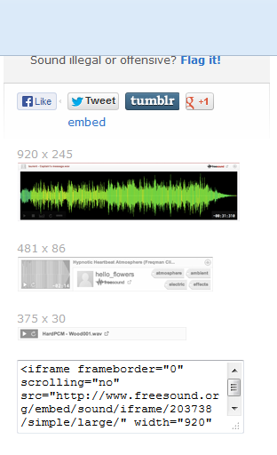

# Audios

Para insertar sonidos, ruidos y ambientes sonoros en nuestra creaciones, sobre todo literarias, tenemos varias posibilidades.

*   **Audio   Freesoundproject** ([http://www.freesound.org](http://www.freesound.org))

Es una plataforma de sonidos, ruidos y ambientes sonoros (no tiene canciones) que son útiles para ambientar narraciones, obras de teatro, cuentos, etc. Los materiales de _freesoundproject_  se encuentran bajo la licencia Creative Commons Sampling  Plus License que es un tipo especial de licencia CC aplicable a los fragmentos sonoros.

[http://www.freesound.org/people/klankbeeld/sounds/203738/](http://www.freesound.org/people/klankbeeld/sounds/203738/)

Cuando elegimos el sonido que queremos embeber en nuestro blog, se abre una página para escucharlo y a la derecha la posibilidad de embeberlo.

*    **SoundBible** ([http://soundbible.com/](http://soundbible.com/))

Es una plataforma donde se pueden encontrar sonidos y efectos en formato wav y mp3 con indicación de tipo de licencia para cada uno de los archivos. 

*   **Canciones Jamendo** ([http://www.jamendo.com/es/](http://www.jamendo.com/es/))

Es  un sitio web en el que se pueden encontrar multitud de álbumes de diferentes categorías musicales que podrán utilizarse para sonorizar cualquier tipo de producto multimedia. Una vez que has seleccionado un álbum o un tema en Jamendo se mostrará la información sobre el mismo, los derechos y un código para incluir un  reproductor en una página web si este va a ser su uso final. 

## Importante

**Para la edición de imágenes** se puede utilizar GIMP, programa libre para la manipulación de imágenes. Es una aplicación adecuada para la edición y composición de imágenes, así como para el retoque fotográfico. Es una herramienta gratuita. Se instala desde el sitio web oficial del proyecto GIMP: [http://www.gimp.org/](http://www.gimp.org/)

**Para grabar sonidos propios y editarlos** se puede usar Audacity. Es un programa libre de código abierto para grabar y editar sonidos. Se puede descargar e instalar el programa en nuestro equipo desde la página [http://audacity.sourceforge.net/](http://audacity.sourceforge.net/)

Puedes consultar un tutorial muy interesante sobre Audacity en [http://www.catedu.es/facilytic/2013/10/11/todas-las-posibilidades-de-audacity/](http://www.catedu.es/facilytic/2013/10/11/todas-las-posibilidades-de-audacity/)

También se puede utilizar para editar las fotos _on-line_ el programa **Photoshop Express.** El manual de este editor lo puedes consultar en [http://www.catedu.es/facilytic/2013/10/21/photoshop-express-edicion-de-fotos-on-line/](http://www.catedu.es/facilytic/2013/10/21/photoshop-express-edicion-de-fotos-on-line/)

Otro editor muy sencillo de fotos es **Pizap**. Puedes consultar la guía de este programa en [http://www.catedu.es/facilytic/2013/10/20/pizap-un-editor-de-fotos-sencillo/](http://www.catedu.es/facilytic/2013/10/20/pizap-un-editor-de-fotos-sencillo/)

