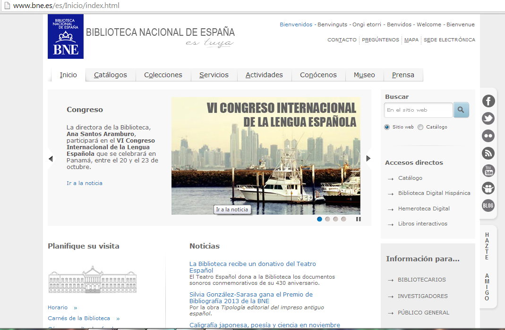
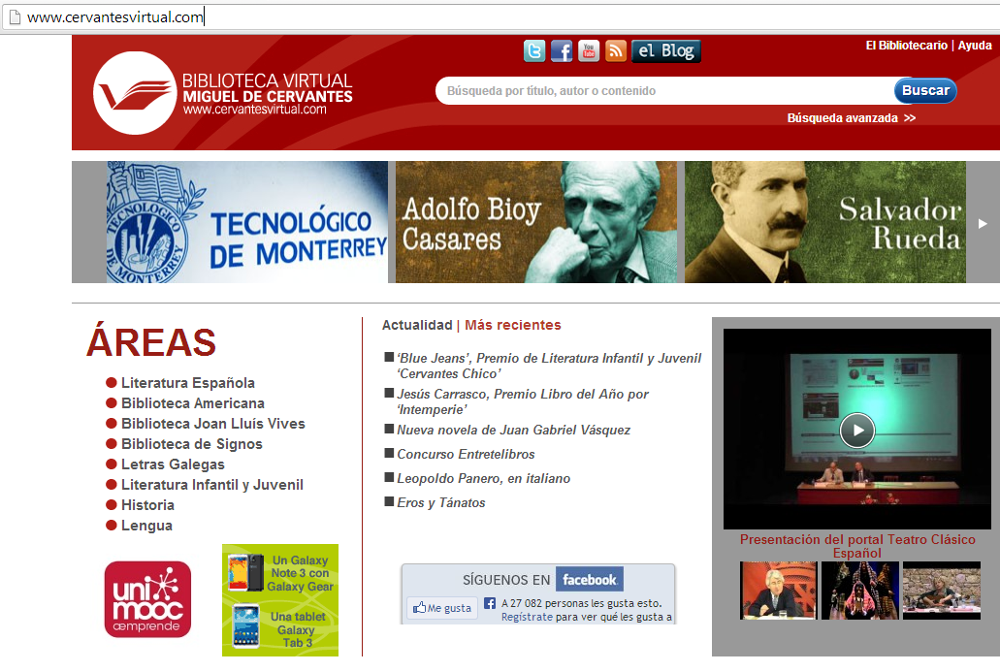
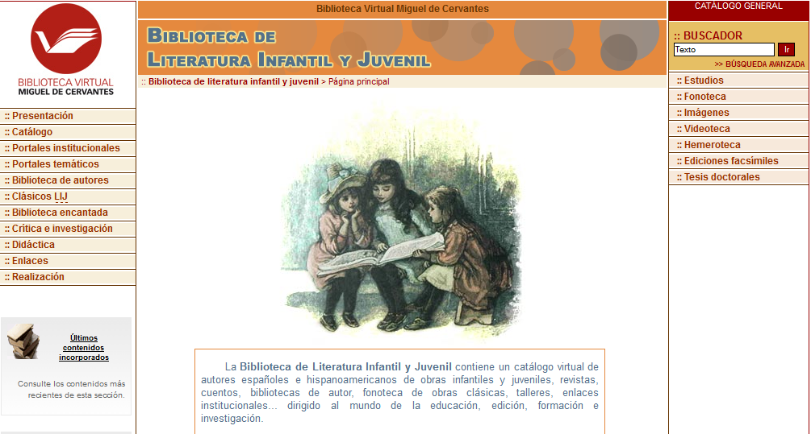

# Bibliotecas

En las bibliotecas, cuyas páginas vamos a citar a continuación, se puede tener acceso a recursos libres si las obras de los autores ya no están sometidas a derechos de autor. Por dominio público se entiende la situación en que quedan las obras al expirar el plazo de protección de los derechos patrimoniales. Esto sucede habitualmente transcurrido un tiempo a partir de la muerte del autor y que, dependiendo de los países, va de 50 a 100 años. 

El dominio público implica que las obras pueden ser explotadas siempre que se respeten los derechos morales.

**La Biblioteca Nacional** ([http://www.bne.es](http://www.bne.es)) es la que posee más fondos bibliográficos. Se pueden solicitar reproducciones de estos fondos  si no están digitalizados y consultar si lo están. Las secciones son [Biblioteca Digital Hispánica](http://www.bne.es/es/Catalogos/BibliotecaDigitalHispanica/Inicio/index.html) y [Hemeroteca Digital](http://hemerotecadigital.bne.es/index.vm), además de [Libros interactivos](http://www.bne.es/es/LaBNE/Publicaciones/LibrosInteractivos/index.html).

La Biblioteca Nacional ofrece la posibilidad de consultar otros catálogos  con fondos digitalizados para su consulta directa en línea como [Biblioteca Digital del Patrimonio Iberoamericano](http://www.iberoamericadigital.net/BDPI/), [Patrimonio Bibliográfico](http://www.mcu.es/bibliotecas/MC/CCPB/index.html), [Publicaciones Periódicas](http://catalogo.bne.es/uhtbin/cgisirsi/x/0/0/57/49?user_id=CCPPWEB). También Bases de datos especiales y gestor de recursos electrónicos como [Archivos personales](http://www.bne.es/es/Catalogos/ArchivosPersonales/index.html), [Cantorales](http://www.bne.es/es/Catalogos/Cantorales/), [El Buscón: recursos-e](http://elbuscon.bne.es:8331/V/34A4MIXSKGPP23H9ANXUEVXNGM932ST66NTUJYFD453MVNAP7T-05109?FUNC=FIND-DB-1&pds_handle=GUEST), [Revistas electrónicas](http://elbuscon.bne.es/sfxlcl3/az?lang=spa) y [Catálogos digitalizados](http://www.bne.es/es/Micrositios/Guias/index.html?BusquedaCategoria=8).

### Biblioteca Virtual Miguel de Cervantes [http://www.cervantesvirtual.com/](http://www.cervantesvirtual.com/)

En la Biblioteca virtual Miguel de Cervantes podemos encontrar las siguientes áreas para buscar textos literarios y de crítica.  

*   [Literatura Española](http://www.cervantesvirtual.com/areas/literatura-espanola-0/)

En esta sección se pueden encontrar miles de obras digitalizadas  de los diferentes géneros literarios y de la historia de la Literatura. El catálogo de la Literatura española e iberoamericana reúne obras de la Biblioteca Nacional de España, de la Real Academia de la Lengua, de otras Academias y Bibliotecas Nacionales de América, y de diversas editoriales. También ediciones facsímiles, actas de congresos, revistas o manuscritos relacionados con la literatura hispánica e iberoamericana.                      

*   [Biblioteca Americana](http://www.cervantesvirtual.com/bib/seccion/ba/)

En esta Biblioteca hay gran cantidad de documentos textuales y audiovisuales sobre la literatura gauchesca, la cultura hispana en Estados Unidos, la creación brasileña. También reúne información de   sor Juana Inés de la Cruz, de Mario Benedetti y de los grandes nombres del exilio español en América. 

*   [Biblioteca de Signos](http://www.cervantesvirtual.com/seccion/signos/)

En la Biblioteca de Signos se incluye material bibliográfico de toda la historia de la educación de personas sordas en España  y de la investigación moderna en lingüística de las lenguas de signos y educación bilingüe.

*   [Literatura Infantil y Juvenil](http://www.cervantesvirtual.com/bib/seccion/bibinfantil/)

La Biblioteca de Literatura Infantil y Juvenil contiene un catálogo virtual de autores españoles e hispanoamericanos de obras infantiles y juveniles, revistas, cuentos, bibliotecas de autor, fonoteca de obras clásicas, talleres, enlaces institucionales, dirigido al mundo de la educación, edición, formación e investigación.

*   [Lengua](http://www.cervantesvirtual.com/bib/seccion/lengua/)

La sección de Lengua de la Biblioteca Virtual Miguel de Cervantes reúne una importante colección de textos de carácter lingüístico.

