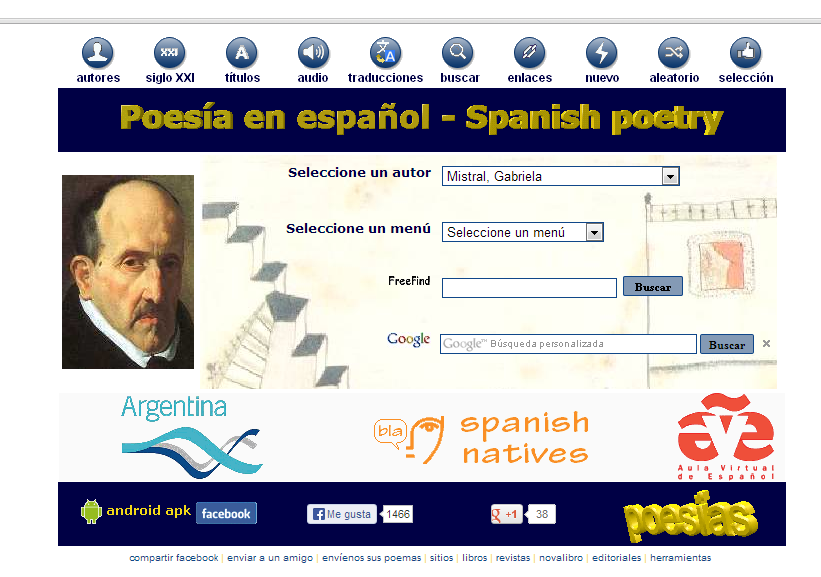
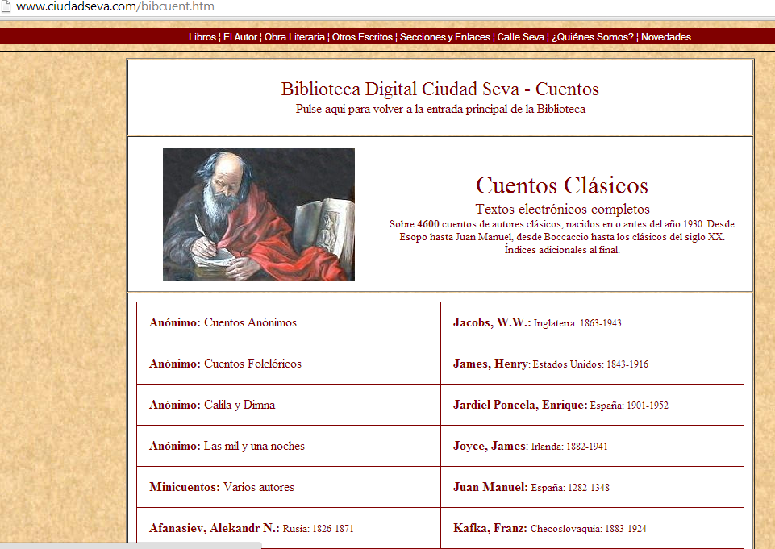

# Bibliotecas Virtuales

**Bibliotecas virtuales**

*   [Biblioteca Virtual Cervantes](http://www.cervantesvirtual.com/)

*   [Biblioteca Digital Hispánica](http://www.bne.es/es/Catalogos/BibliotecaDigitalHispanica/Inicio/)

*   [Poesía en español](http://www.poesi.as/)

Biblioteca de poetas españoles.

Fig. 2.36 _Página de poesía_

*   [Biblioteca Digital Ciudad Seva](http://www.ciudadseva.com/bibcuent.htm)

La Biblioteca Digital Ciudad Seva es una de las bibliotecas literarias más importantes de Internet, en cualquier idioma. Además, es la sede de varios talleres,  y foros literarios y culturales que reúnen a miles de escritores y lectores del mundo entero. 

Fig. 2.37 _Página la de Biblioteca Digital Ciudad Seva_

