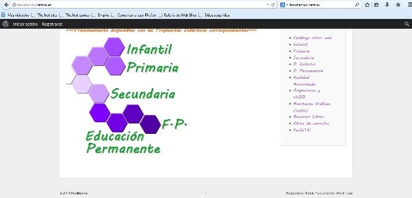

# CATEDU

**Repositorio educativo Catedu** ([http://www.catedu.es/](http://www.catedu.es/webcatedu/index.php/recursosdidacticos/recursos-libres))

En la página principal podemos encontrar en Menú principal recursos didácticos

Fig 2.21  _Pantalla inicial de CATEDU_

Son de gran utilidad para los profesores de Lengua castellana y Literatura

*   [Recursos didácticos](http://www.catedu.es/webcatedu/index.php/recursosdidacticos)
    *   [Catálogo sitios web](http://www.catedu.es/webcatedu/index.php/recursosdidacticos/catalogositiosweb)
    *   [Recursos Libres](http://www.catedu.es/webcatedu/index.php/recursosdidacticos/recursos-libres)
    *   [Obras de consulta](http://www.catedu.es/webcatedu/index.php/recursosdidacticos/obrasdeconsulta)
    *   [Infantil](http://www.catedu.es/webcatedu/index.php/recursosdidacticos/infantil)
    *   [Primaria](http://www.catedu.es/webcatedu/index.php/recursosdidacticos/primaria)
    *   [Secundaria](http://www.catedu.es/webcatedu/index.php/recursosdidacticos/secundaria)
    *   [E. Inclusiva](http://www.catedu.es/webcatedu/index.php/recursosdidacticos/educacionespecial)
    *   [E. Permanente](http://www.catedu.es/webcatedu/index.php/recursosdidacticos/educacionpermanente)
    *   [Universidad](http://www.catedu.es/webcatedu/index.php/recursosdidacticos/universidad)
    *   [FacilyTIC](http://www.catedu.es/facilytic/)

La sección Recursos libres [http://www.catedu.es/webcatedu/index.php/recursosdidacticos/recursos-libres](http://www.catedu.es/webcatedu/index.php/recursosdidacticos/recursos-libres)

es  un catálogo de imágenes, efectos, sonidos, cliparts, música, etc. que no tienen derechos de autor para permitír el libre uso de los mismos en nuestra labor docente.   

Fig.2.22 _Acceso a sonidos sin licencia desde CATEDU_

**Unidades didácticas o cursos completos**

También ofrece [CATEDU](http://e-ducativa.catedu.es/44700165/sitio/index.cgi?wid_item=118&wid_seccion=22)  la posibilidad de descargar unidades o asignaturas completas de la materia que te interese

****

 Fig. 2.23 _Asignaturas completas de Secundaria y Bachillerato_                        Fig. 2.24 _Asignaturas completas de Primaria_

**Facili[t@mos,](mailto:t@mos,) repositorio de propuestas didácticas **([http://facilitamos.catedu.es/](http://facilitamos.catedu.es/))

Catedu nos ofrece una nueva plataforma llena de propuestas didácticas para Primaria, Secundaria, Formación Profesional y Educación Permanente.

 

                        Fig. 2.25 _Pantalla inicial del portal Facilit@mos_

