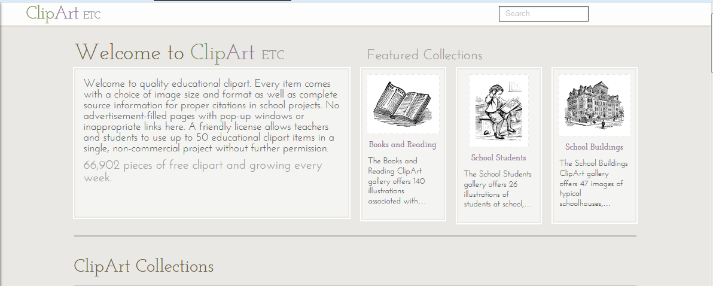

# Cliparts

Para crear un contenido didáctico se necesitan dibujos  que nos permitan mostrar una visión sencilla de un determinado elemento. Las colecciones de cliparts proporcionadas por los paquetes ofimáticos son una alternativa, pero no se especifica claramente si pueden ser  distribuidos y, además, suelen ser ser poco originales.

*   **Centro de Tecnología Educativa de Florida** ([http://etc.usf.edu/clipart](http://etc.usf.edu/clipart))

En este mismo lugar se pueden encontrar fondos y temas muy útiles  para las presentaciones que preparamos los docentes [http://etc.usf.edu/presentations](http://etc.usf.edu/presentations)

*   **Open Clipart Library** ([http://openclipart.org/](http://openclipart.org/))

Los cliparts se encuentran en formato vectorial svg, de manera que se pueden escalar y adaptarlos a nuestras necesidades sin que pierdan calidad. 

