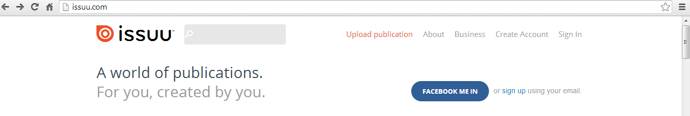
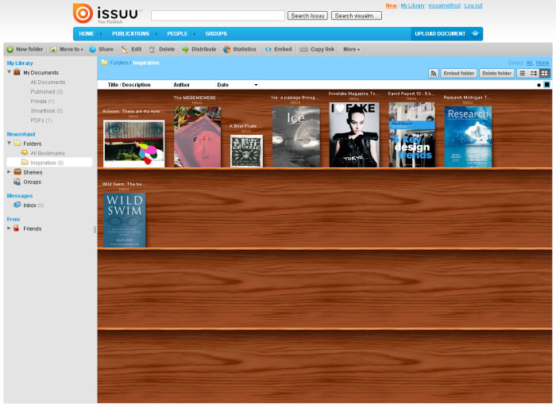

# Compartir presentaciones con [Issuu](http://issuu.com/)

**Issuu** es un servicio en línea que permite la visualización de material digitalizado electrónicamente, como libros, portafolios, números de revistas, periódicos, y otros medios impresos. El material subido al sitio es visto a través de un [navegador web](http://es.wikipedia.org/wiki/Navegador_web "Navegador web") y está hecho para parecerse lo más posible a una publicación impresa, con un formato que permite la visualización de dos páginas a la vez (como un libro o una revista abiertos) y una vuelta animada a la página. Aunque los documentos en Issuu están diseñados para verse en línea, es posible guardar una copia de ellos. Es un servicio recomendado para guardar **documentos en  formato PDF**.

Para crear una cuenta en issuu hay que entra en la página de inicio y pulsar Creative Account y rellenar todos los campos. Después ya podemos subir nuestras producciones.

Lo primero que llama la atención de Issuu es su atractivo aspecto diseñado en Flash. La página tiene un diseño muy elegante, con una zona de estantería donde ver todas tus publicaciones y suscripciones como si de una tienda se tratara.

En tu estantería de Issuu puedes agregar cuantos documentos quieras y compartirlos con los demás, pero si eres un usuario con registro gratuito existe un límite de 100 MB o 500 páginas por archivo. Sin embargo, el contenido en español en Issuu es actualmente limitado. 

###  Tutorial de issuu

http://www.youtube.com/watch?v=xXj7SKB7QUY

