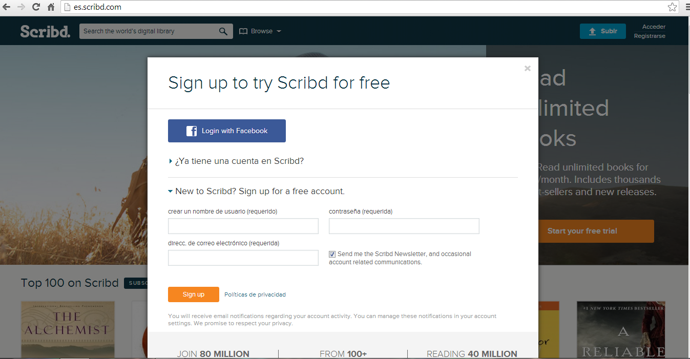
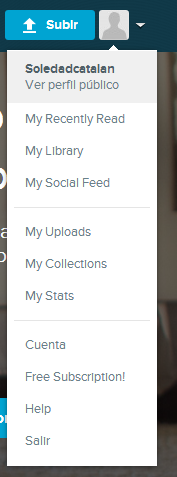

# Compartir presentaciones con Scrib

**1\. Compartir presentaciones con scrib  ([http://es.scribd.com/](http://es.scribd.com/)****)**

**Scribd**  es un sitio web para compartir documentos que permite a los usuarios publicar documentos de diversos formatos e incrustarlos en una página web. Además, cuando subes un documento y lo publicas puedes:

*   Descargar el documento.
*   Imprimirlo.
*   Verlo a pantalla completa.
*   Compartirlo.
*   Editarlo.
*   Borrarlo.

 Para crearse una cuenta en Scrib hay que ir a su página inicial y registrarse:

                

A continuación, ya podemos empezar a subir nuestros trabajos desde el icono Subir 

 

 En el icono de al lado, podemos consultar nuestro perfil, nuestros trabajos, nuestra librería, nuestras colecciones etc.    

Si ya hemos guardado algún trabajo lo podemos embeber en nuestro blog y el resultado es el que siguiente:

  Vídeo 9.  [Comentario de Romance de  la luna luna](http://es.scribd.com/doc/72492828/Romance-de-La-Luna-Luna?secret_password=1qs40r12hn2is21jt63z "View Romance de La Luna Luna on Scribd"), [de Federico García Lorca](-Luna?secret_password=1qs40r12hn2is21jt63z)                                                      

**Tutorial de cómo alojar y compartir documentos con Scrib **

                                                                    Vídeo 10.    [Tutorial Scribd](http://es.scribd.com/doc/3077260/Tutorial-Scribd "View Tutorial Scribd on Scribd") [http://es.scribd.com/doc/3077260/Tutorial-Scribd](http://es.scribd.com/doc/3077260/Tutorial-Scribd)

