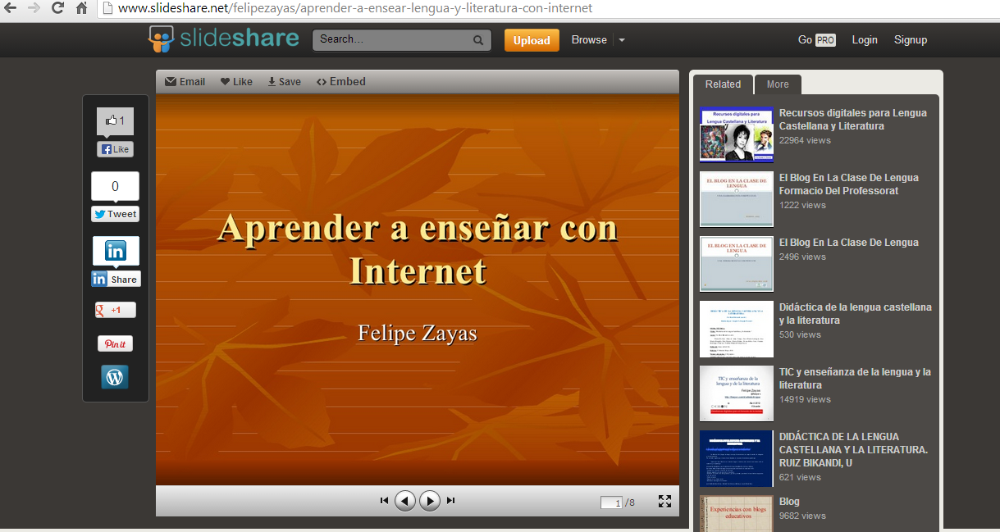

# Compartir presentaciones con Slideshare

**1- Compartir presentaciones con Slideshare**

Es un espacio gratuito que permite enviar presentaciones para visualizarlas _online_ y compartirlas en red. Para utilizarlo es suficiente con abrir una cuenta en Slideshare, editar el perfil, adjuntar la presentación, publicarla y difundirla en un sitio web o blog. [http://www.slideshare.net](http://www.slideshare.net)

 

                                                 Fig. 3.11  _Página para abrir una cuenta en slideshare_

Después de crear tu cuenta y acceder al servicio ve a "Upload" y "Browse and select files" para seleccionar y subir tu archivo.

  

                          Fig. 3.12  _Página para subir archivos a slideshare_  
  
Da la información que consideres oportuna para que otros encuentren tu presentación (título, etiquetas, descripciones, etc.) y ve a publicar. Una vez que esté publicada comprueba que dispones de opciones similares a las de las otras herramientas (enviar por email, descargar, etc.). Si lo que decides finalmente es colocar el código que Slideshare te ofrece en tu blog o página web, el resultado será este:

Video 7.** [Tipos de la Comprensión Lectora](https://www.slideshare.net/careducperu/tipos-de-la-comprensin-lectora-214090 "Tipos de la Comprensión Lectora")  de [careducperu](http://www.slideshare.net/careducperu/tipos-de-la-comprensin-lectora-214090)**

****

Para subir presentaciones a Slideshare te recomendamos el siguiente tutorial

Vídeo 8. [Cómo subir presentaciones en SlideShare](https://www.slideshare.net/abocc/como-subir-presentaciones-en-slideshare-presentation "Como subir presentaciones en SlideShare") de  [Amalia Boccolini](http://www.slideshare.net/abocc)

**Muchos son los recursos para el área de Lengua castellana y Literatura que podemos encontrar en slideshare**

****

         Fig. 3.13 [_Materiales de Lengua castellana y Literatura en slideshare_](http://www.slideshare.net/felipezayas/aprender-a-ensear-lengua-y-literatura-con-internet)

 Para aprender a trabajar con slideshare es imprescindible leer [http://www.catedu.es/facilytic/2013/10/09/comparte-tus-presentaciones-en-internet-con-slideshare/](http://www.catedu.es/facilytic/2013/10/09/comparte-tus-presentaciones-en-internet-con-slideshare/)

