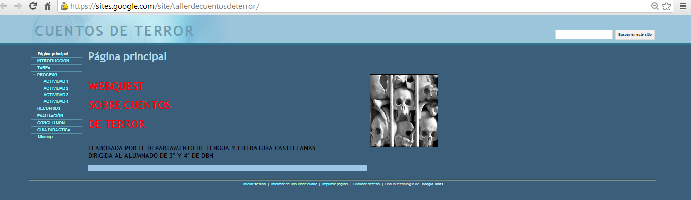

# Creador de WebQuest con Google Sites

Google Sites,  que ya vimos en el módulo anterior como herramienta para crear  wikis,  también nos permite construir WebQuest.

Además,  frente a otras herramientas, colaborar entre varias personas en su elaboración, por ejemplo en clase con los alumnos.

A continuación mostramos dos tutoriales para conocer todos los entresijos para elaborar una WebQuest con Google Sites.

Vídeo 6. [Webquest google sites](https://www.slideshare.net/pazgonzalo2/webquest-google-sites "Webquest google sites")  de  [Paz Gonzalo](http://www.slideshare.net/pazgonzalo2)

  Video 7 [http://www.youtube.com/watch?v=ALQIp800YFU](http://www.youtube.com/watch?v=ALQIp800YFU) de Antonieta

Este sería el aspecto de una WebQuest realizada con Google Sites

 Fig. 5.9 _WebQuest creada con Google Sites _

[https://sites.google.com/site/tallerdecuentosdeterror/](https://sites.google.com/site/tallerdecuentosdeterror/)

