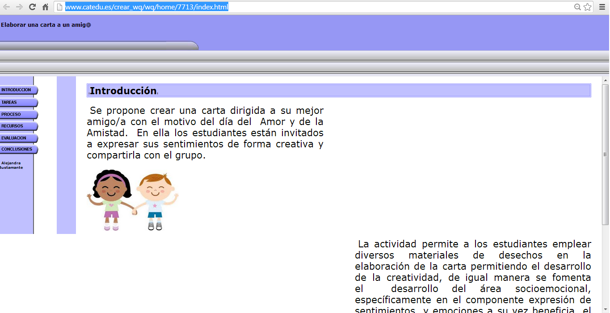

# Creador de WebQuest de CATEDU

CATEDU ofrece la posibilidad de crear nuestra WebQuest de manera rápida y sencilla. Hay que acceder  a 

[http://catedu.es/crear\_wq/z\_usuarios/ingreso_usuarios.php](http://catedu.es/crear_wq/z_usuarios/ingreso_usuarios.php)

 

 Fig. 5.4  _Página de inicio para registrarse en el servicio de CATEDU para crear WebQuest_

Hay que registrarse y aparecerá la siguiente pantalla en la que ya podrás crear tu WebQuest de forma muy sencilla.

                                 Fig. 5.5  _Tu página para crear una WebQuest_

Aquí te mostramos un ejemplo

          Fig. 5.6  _Ejemplo de WebQuest en __CATEDU_

 [http://www.catedu.es/crear_wq/wq/home/7713/index.html](http://www.catedu.es/crear_wq/wq/home/7713/index.html)

 Para saber más puedes consultar el manual

[http://catedu.es/crear\_wq/z\_usuarios/archivos/manual\_creador\_WQ_v01.pdf](http://catedu.es/crear_wq/z_usuarios/archivos/manual_creador_WQ_v01.pdf)

