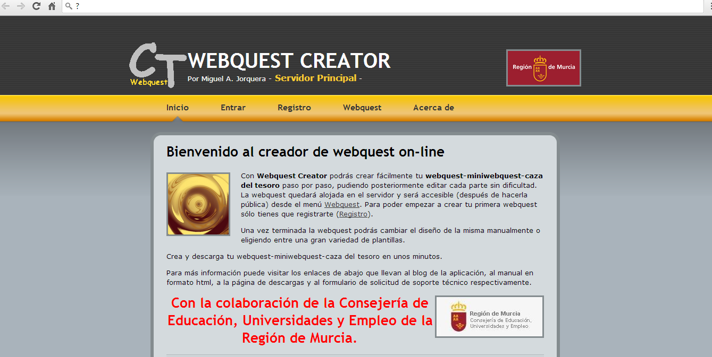
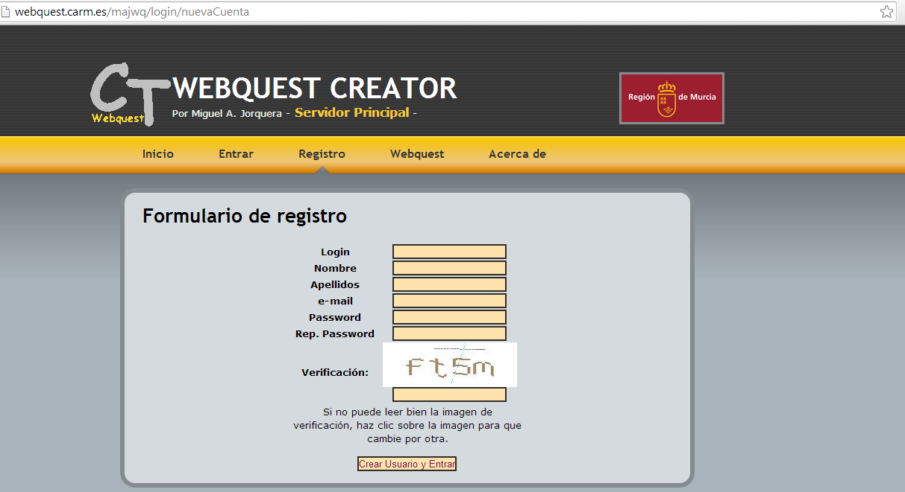

# Creador de WebQuest webquest Creator

Otra posibilidad para poder crear una WebQuest _on line_ la ofrece [Webquest Creator](http://webquest.carm.es/ "Webquest Creator"), creada por el profesor Miguel A. Jorquer y  donde se pueden elaborar de manera sencilla  Webquests y Cazas de Tesoros.

 Hay que registrase y después se puede comenzar a crear  una WebQuest

                    

En este sencillo manual encontrarás las claves para elaborar una WebQuest 

   <a title="View Manual Wct on Scribd" href="https://www.scribd.com/document/18970460/Manual-Wct#from_embed"  style="text-decoration: underline;" >Manual Wct</a> by <a title="View Francisco M de la Peña's profile on Scribd" href="https://es.scribd.com/user/2211/Francisco-M-de-la-Pena#from_embed"  style="text-decoration: underline;" >Francisco M de la Peña</a> on Scribd
<iframe class="scribd_iframe_embed" title="Manual Wct" src="https://www.scribd.com/embeds/18970460/content?start_page=1&view_mode=scroll&access_key=key-wdktsxaqex71675rpbr&show_recommendations=true" data-auto-height="false" data-aspect-ratio="0.75" scrolling="no" id="doc_80089" width="100%" height="600" frameborder="0"></iframe>
