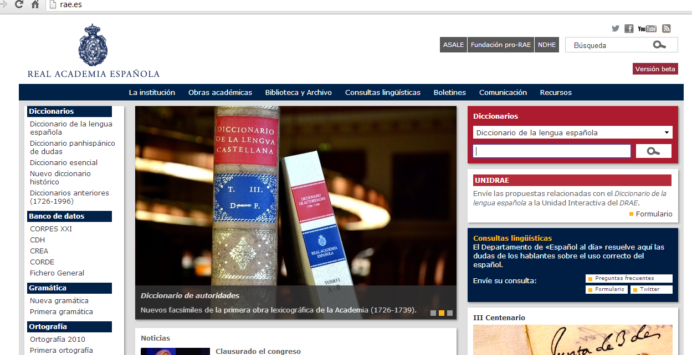
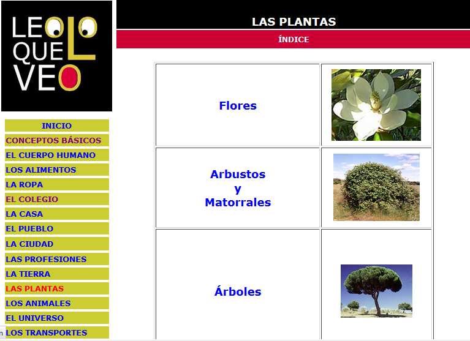

# Diccionarios

*   [**Diccionario Salamanca de la Lengua Española**](http://fenix.cnice.mec.es/diccionario/) (Intef)

Es un diccionario de español para estudiantes y profesores de español, tanto como lengua materna como lengua extranjera. Está dirigido específicamente para la enseñanza, y así, junto a las definiciones de cada término, aparecen, cuando es oportuno, el uso de esas palabras dentro de locuciones frecuentes y la información gramatical precisa.

*   [**Diccionario de la lengua española y Diccionario panhispánico de dudas**](http://www.rae.es/) (RAE)

**Diccionarios multimedia**

*   [**Leo lo que veo**](http://www.leoloqueveo.org/ "Leo lo que veo")

Es un diccionario cuyo objetivo es facilitar el aprendizaje del vocabulario y la comprensión lectora a los alumnos/as de Educación Infantil y Primaria, especialmente a aquellos que presentan dificultades de acceso a la lengua (por discapacidad auditiva, desconocimiento del idioma u otros problemas que dificulten el proceso de aprendizaje).

****

