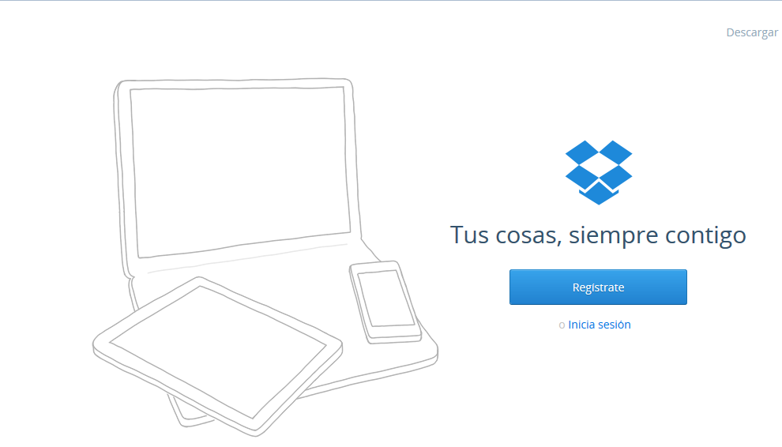

# Dropbox

**2\. Compartir con Dropbox**

**Dropbox**  también ofrece el servicio de alojamiento de archivos multiplataforma en la nube, operado por la compañía Dropbox. Permite a los usuarios almacenar y sincronizar archivos en línea y entre ordenadores, y compartir archivos y carpetas con otros. [https://www.dropbox.com/features](https://www.dropbox.com/features)

Te recomendamos la lectura del manual [http://www.catedu.es/facilytic/2013/05/16/dropbox/](http://www.catedu.es/facilytic/2013/05/16/dropbox/)

 Fig. 3.5 _Página inicial para registrarse en Dropbox_

                  Vídeo 2.  [Manual básico de Dropbox](https://www.slideshare.net/juanjbano/manual-bsico-de-dropbox "Manual básico de Dropbox") [Juan Jesús](http://www.slideshare.net/juanjbano)

