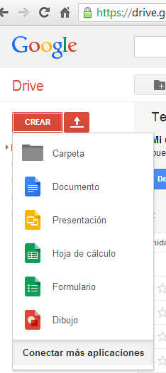
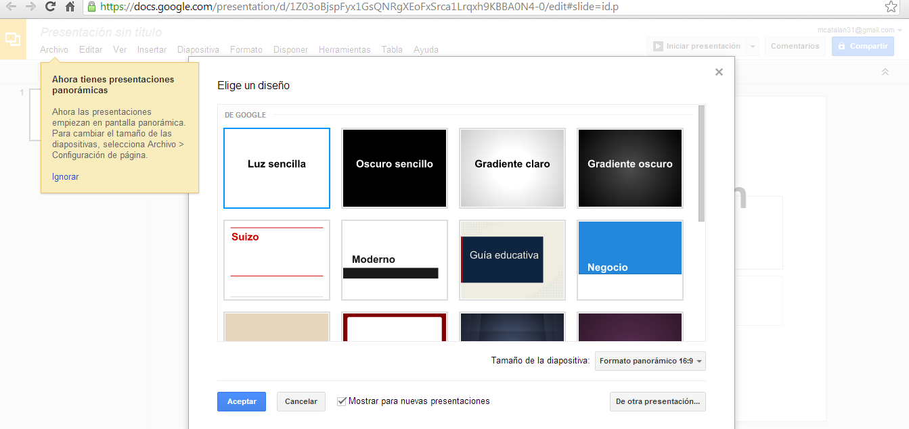

# Elaborar una presentación con DRIVE

Otra posibilidad muy interesante y sencilla para crear presentaciones con diapositivas la ofrece Google Drive, del que ya hemos tratado en la unidad 1 de este mismo módulo.

Con esta herramienta las presentaciones se pueden realizar de manera colaborativa.

Para ello hay que acceder a [http://www.google.com/drive/](http://www.google.com/drive/) y entrar con tu cuenta y usuario. A continuación, pulsar en **Crear** 

y se desplegará el siguiente menú:

                                                            Vídeo 6. Presentación con Google Drive.

Se Selecciona**Presentación** y ya se puede empezar a trabajar

