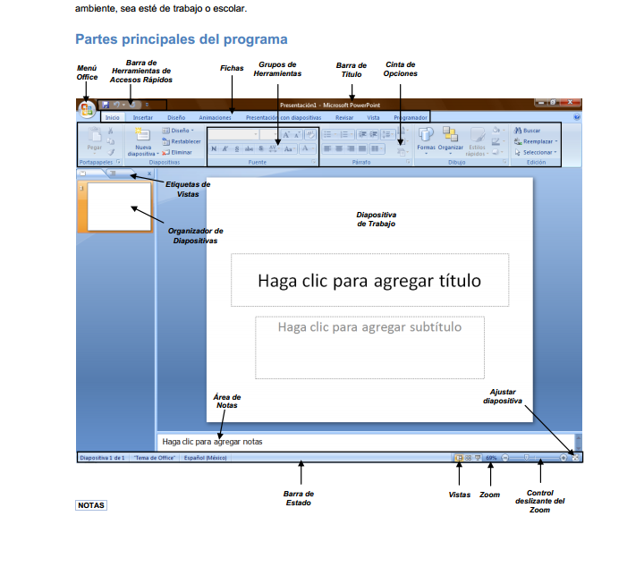

# Elaborar una presentación con PowerPoint

PowerPoint es una programa que está dentro del paquete que ofrece Microsoft Office. Para empezar a trabajar con PowerPoint se arranca el programa.

**Crear presentaciones**

Una presentación de PowerPoint es un archivo que incluye una o varias diapositivas que se pueden utilizar para presentar por lo general en pantalla la información, mediante objetos, textos, animaciones, etc.

**Abrir presentaciones nuevas en blanco**

1\. Hacer clic en el botón de Microsoft Office y, a continuación,  clic en **Nueva**.  
2\. En el cuadro de dialogo **Nueva presentación**, hacer doble clic en **Presentación en blanco**, o seleccionar   
dicha opción y presionar el botón Crear.

*   **La pantalla inicial**:

La pantalla inicial es aquella que se abre al iniciar el PowerPoint, no tiene por que ser igual en todos los ordenadores ya que se puede modificar los menús y herramientas que contienen. En esta pantalla en la parte central aparece la diapositiva con la que trabajamos en ese momento.

 

 

Después de elegir [Abrir el programa](http://aularagon.catedu.es/materialesaularagon2013/presentaciones/PowerPoint2007/21_abrir_el_programa.html) , seleccionamos   [una nueva presentación](http://aularagon.catedu.es/materialesaularagon2013/presentaciones/PowerPoint2007/42_empezamos_por_fn.html) e [Insertar diapositivas](http://aularagon.catedu.es/materialesaularagon2013/presentaciones/PowerPoint2007/44_insertar_una_nueva_diapositiva.html).

Sigue las indicaciones para insertar  [texto](http://aularagon.catedu.es/materialesaularagon2013/presentaciones/PowerPoint2007/45_y_el_texto.html), e  imágenes [desde archivo](http://aularagon.catedu.es/materialesaularagon2013/presentaciones/PowerPoint2007/12_desde_archivo.html) o [desde Internet](http://aularagon.catedu.es/materialesaularagon2013/presentaciones/PowerPoint2007/13_desde_internet.html).

https://www.youtube.com/watch?v=CbkYvZ_GxxA
