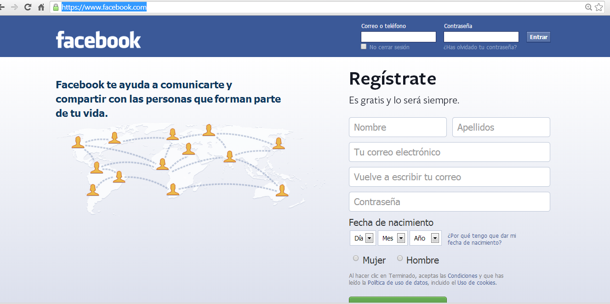

# Facebook

Lo primero que hay que hacer para entrar en Facebook es crearse una cuenta en la página de inicio [https://www.facebook.com/](https://www.facebook.com/)

A continuación, debes seguir los pasos que te indica este sencillo tutorial

<iframe src="//www.slideshare.net/slideshow/embed_code/key/D8TdwQczXgO76Q" width="668" height="714" frameborder="0" marginwidth="0" marginheight="0" scrolling="no" style="border:1px solid #CCC; border-width:1px; margin-bottom:5px; max-width: 100%;" allowfullscreen> </iframe> 
 <strong> <a href="//www.slideshare.net/Agnetagsu/manual-facebook-2013-cuenta-privacidad-fotos-chatear-y-mensajes-privados" title="Manual Facebook (2013): cuenta, privacidad, fotos, chatear y mensajes privados." target="_blank">Manual Facebook (2013): cuenta, privacidad, fotos, chatear y mensajes privados.</a> </strong> from <strong><a href="https://www.slideshare.net/Agnetagsu" target="_blank">Agneta Gallardo</a></strong> 

**Seguridad y privacidad en Facebook**

Es muy importante que el usuario sepa con claridad qué es lo que están viendo los demás y lo que pueden saber de nosotros. La mayoría de la información personal se introduce durante el registro, por lo que el primer consejo es limitarse a responder los **datos realmente imprescindibles, ** que suelen ser el nombre, apellidos y correo electrónico.  Siguiendo las leyes de Estados Unidos, esta red **no permite el registro a los menores de 13 años**. En Facebook es posible controlar de forma muy eficiente toda nuestra información. T**e recomendamos que dediques tiempo** a configurar todas y cada una de las posibilidades que te ofrece esta red para preservar tu intimidad. Debes tener en cuenta que, según las opciones de configuración que escojamos, incluso personas no registradas en Facebook podrían ver nuestra actividad o datos.

**Privacidad:** una vez estamos en Facebook podemos pulsar sobre la flecha que hay a la derecha de inicio y seleccionar **Configuración de la privacidad**, lo que nos permitirá configurar algunos aspectos generales (no todos) de la misma.

Las tres opciones que aparecen en la parte superior hacen referencia a la visibilidad de lo que hagamos **cuando no estemos en Facebook** pero lo usamos a través de otro servicio. También aparecerá como **opción predeterminada para las publicaciones de Facebook** aunque podremos cambiarlo para cada una en particular. Podremos elegir entre **Público** (todos lo ven), **Amigos** (sólo nuestros amigos lo ven) o **Personalizado** (podremos elegir personas o listas de personas, si tenemos alguna, que lo podrán ver). El resto de opciones que encontramos en esta página se describen a continuación: Cómo conectas. Esta opción nos permite definir, quién podrá ver nuestro perfil, quién puede enviarnos solicitudes de amistad, quién puede enviarnos mensajes en Facebook quién puede escribir en nuestro muro y quién podrá ver lo que escriban los demás en él.

**Cómo funcionan las etiquetas: ** en Facebook pueden etiquetarnos en fotos y texto, es decir, pueden asociar nuestro perfil en un texto o imagen. Desde aquí controlamos si queremos aprobar nuestras etiquetas antes de que aparezcan públicamente, quién las puede ver, si queremos que Facebook sugiera nuestro nombre cuando alguien suba una foto que se parezca a nosotros, etc.

**Aplicaciones y sitios web:** en Facebook hay infinidad de aplicaciones como juegos, calendarios, encuestas, votaciones, concursos, etc. Las podremos ver todas desde aquí y eliminarlas si ya no nos interesan.

**Personas y aplicaciones bloqueadas:** cuando alguien nos pide usar una aplicación de Facebook podemos elegir bloquearla para que no nos moleste más. También podemos bloquear personas y eventos. En esta sección los veremos todos y podremos decidir dejar de bloquearlos. 

Disponemos de una gran cantidad de opciones en la edición del **perfil**. Para verlas debemos pulsar sobre nuestro nombre y después sobre **Editar perfil**. A la izquierda aparecerá un menú que nos permitirá elegir el tema que vamos a configurar y a la derecha todas las opciones sobre las que vamos a decidir quién las verá. Podremos decidir quién podrá ver nuestra edad, nuestros intereses, lugar de estudio, aficiones, amigos, familiares, ideología política, religión, etc. Hay que revisar todas y cada una de las opciones para estar seguro de que no estamos exponiendo información de forma incontrolada.

**Configuración de la cuenta:** en la configuración de la cuenta podremos acabar de decidir ciertos aspectos de seguridad que afectan a la forma de cómo nos conectamos, la contraseña que usamos, etc. Debemos pulsar sobre la flecha que hay a la derecha de **Inicio** y después en **Configuración de la cuenta**.

A la izquierda dispondremos de un menú para seleccionar el aspecto que deseemos modificar:

*   **General:** aquí disponemos de opciones como la contraseña, nombre de usuario, correo electrónico, etc.

*   **Seguridad:** tenemos aspectos tan importantes como el uso de una navegación segura, que cuando Facebook detecte que nos conectamos desde un ordenador diferente al habitual nos envíe un correo electrónico avisando (esto último es muy útil para saber si alguien consigue entrar en nuestra cuenta), o los últimos lugares desde los que nos hemos conectado, entre otros. Aquí también podremos desactivar nuestra cuenta de Facebook, tal como se indica más abajo.

*   **Notificaciones:** podremos controlar los mensajes que recibimos de Facebook.

*   **Aplicaciones:** podremos ver las aplicaciones que utilizamos en Facebook y podremos eliminarlas si ya no nos interesan. A esta opción también se accede desde el menú de **Privacidad.**

*    El menú **Móvil** nos permitirá utilizar Facebook a través de móviles y_ tablets._

*    **Anuncios en Facebook:** Facebook se reserva el derecho de usar nuestro perfil para determinados anuncios (por ejemplo, para recomendar a los amigos una página web que seguimos). Podemos impedirlo en este menú pulsando sobre **Editar la configuración de publicidad aplicable a terceros**y seleccionando la opción deseada:**Nadie**** o Sólo mis amigos**.

*   **Visibilidad** de lo que publicamos en Facebook

Cada vez que escribimos un mensaje tenemos un botón con el icono de una bola del mundo donde podremos elegir quién podrá verlo. A este botón se le llama el selector de audiencia. Aparecerá como opción predeterminada la que hayamos puesto en **Configuración de la privacidad**.

Es muy importante la configuración de esta característica cada vez que intervenimos en Facebook, ya que es la que determinará el alcance de la información que publicamos.  

Para **desactivar la cuenta** accederemos a la **Configuración de la cuenta **y seleccionaremos la opción **Seguridad.** En la parte inferior veremos un enlace con el texto **Desactivar mi cuenta**. Tras avisarnos de lo que implica desactivar la cuenta, podremos pulsar el botón **Confirmar**. Recuerda que la desactivación no implica que desaparezcas de Facebook ni siquiera de forma temporal, ya que los demás podrán seguir interactuando con tu perfil (aunque sea un perfil fantasma) y, si no indicas lo contrario, seguirás recibiendo los correos que te afecten.

Facebook no dispone de un acceso intuitivo y sencillo para poder **darse de baja** realmente de la red, por lo que ponemos a continuación un enlace directo. Tras informarnos de que nuestra cuenta será eliminada, lo podremos efectivo hacer pulsando el botón **Eliminar mi cuenta**: [https://www.facebook.com/help/contact.php?show\_form=delete\_account](https://www.facebook.com/help/contact.php?show_form=delete_account)

Véase,  [http://www.wikisaber.es/comunidadwiki/blogs/blogpost.aspx?id=14961&blogid=63860](http://www.wikisaber.es/comunidadwiki/blogs/blogpost.aspx?id=14961&blogid=63860)

