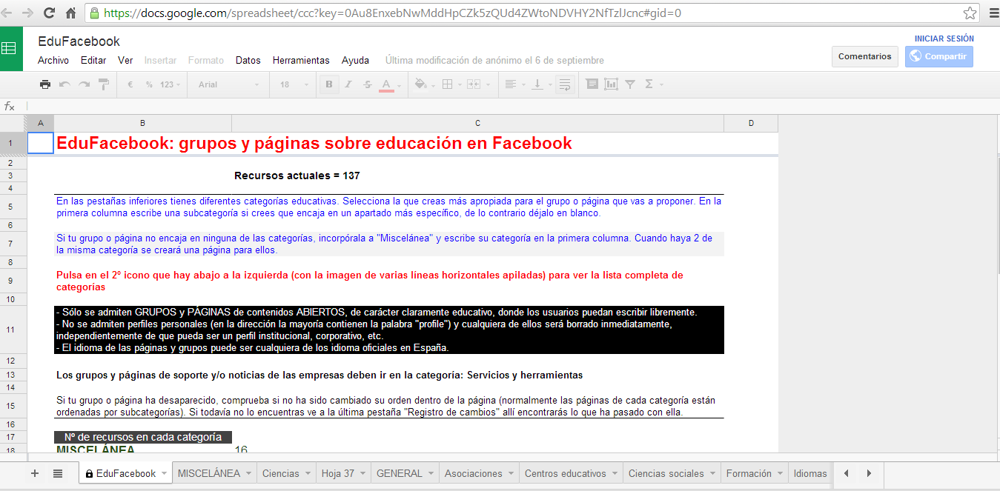
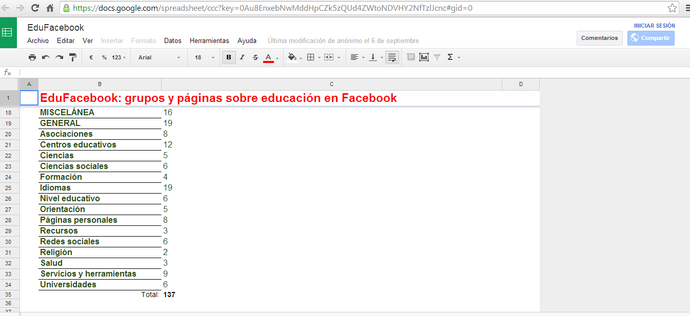

# Facebook para docentes

Facebook contiene herramientas magníficas de  participación y colaboración en la labor educativa. Se pueden encontrar grupos y páginas relacionadas con la docencia. La diferencia entre un grupo y una página es que para ver el contenido de un grupo se precisa de una cuenta en Facebook mientras que las páginas pueden ser vistas por cualquiera, tenga o no un perfil en Facebook. Además, los grupos se pueden hacer privados de forma que sólo sus miembros puedan verlos. La elección entre un tipo u otro depende de la persona encargada de crearlo y encontraremos de ambos tipos dedicados enteramente a temas educativos.

Tanto las páginas como los grupos permiten el intercambio de información, enlaces, recursos, vídeos y cualquier objeto que sea de interés para los temas de los que tratan. Los grupos y páginas son también lugares resolver dudas o realizar preguntas sobre los temas de nuestro interés.  

Algunos de los grupos o páginas que podemos encontrar de tipo general son:

*   [Docentes](http://www.facebook.com/groups/126847027370642/ "Docentes") es uno de los grupos más numerosos donde se habla de educación en general.

*   [Taller](http://internetaula.ning.com/group/redessocialeseneducacin "taller") de Internet en el Aula, se tratan temas centrados en la web social.

*   [Orientación educativa](https://www.facebook.com/login.php?next=https%3A%2F%2Fwww.facebook.com%2Fgroups%2F111339492299888%2F) este grupo, surgido a partir de un curso de redes sociales para orientadores, ha permanecido activo desde entonces.

*   [Eventos y actividades educativas](https://www.facebook.com/login.php?next=https%3A%2F%2Fwww.facebook.com%2Fgroups%2Feveducativos%2F) se comparten actividades educativas como congresos, conferencias, cursos, etc.

*   [Educadores y herramientas TIC](https://www.facebook.com/login.php?next=https%3A%2F%2Fwww.facebook.com%2Fgroups%2FeducadoresyTIC%2F) es un grupo dedicado a las herramientas TIC.

Se pueden encontrar más grupos y páginas ordenados por categorías en [EduFacebook](https://docs.google.com/spreadsheet/ccc?key=0Au8EnxebNwMddHpCZk5zQUd4ZWtoNDVHY2NfTzlJcnc#gid=0 "EduFacebook"). Cualquiera puede añadir la página y el grupo que quiera ya que es un documento elaborado de forma colaborativa entre todos. En estos momentos contiene más de 100 recursos educativos de Facebook 

Los recursos educativos se distribuyen en los siguientes apartados: MISCELÁNEA, GENERAL, Asociaciones, Centros educativos, Ciencias, Ciencias sociales, Formación, Idiomas, Nivel educativo, Orientación, Páginas personales, Recursos, Redes sociales, Religión, Salud, Servicios y herramientas, Universidades.

 

