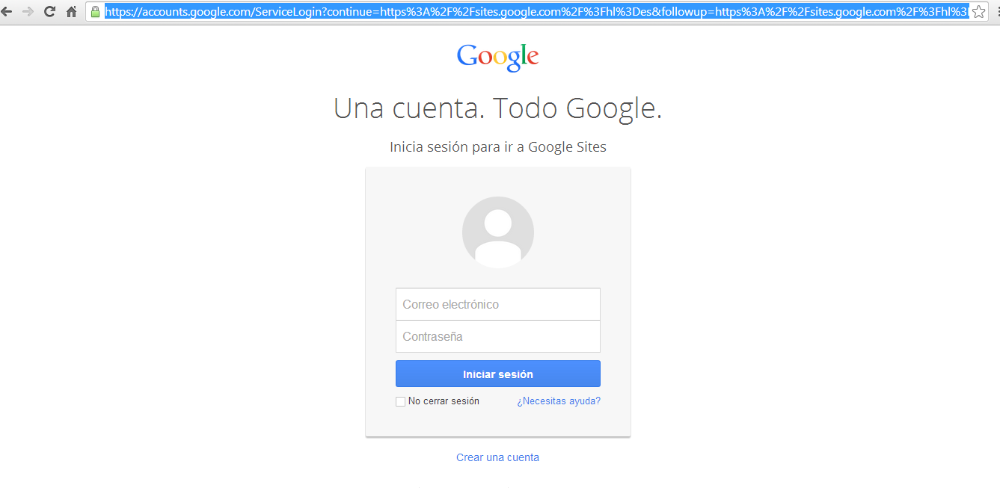
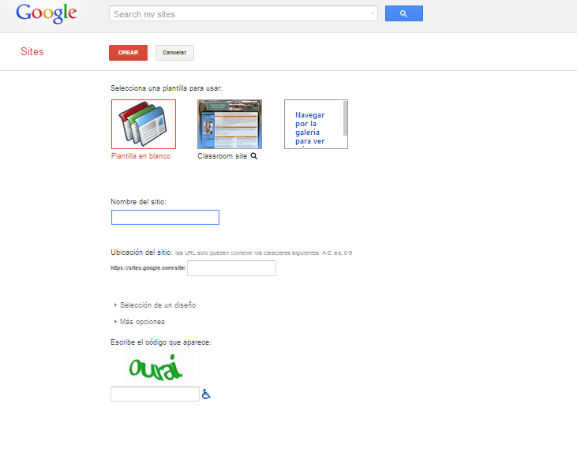

# Google Sites

** Google Sites**

Google  presenta la novedad de acceder a todas sus posibilidades desde una única cuenta de correo de Gmail. Accedemos a [Google sites](https://accounts.google.com/ServiceLogin?continue=https%3A%2F%2Fsites.google.com%2Fsite%2F&followup=https%3A%2F%2Fsites.google.com%2Fsite%2F&service=jotspot&ul=1) con el nombre de usuario y contraseña de nuestro correo Gmail. Google nos ofrece un manual muy sencillo y práctico para manejarnos en Google sites [https://sites.google.com/site/webscolaborativas/](https://sites.google.com/site/webscolaborativas/). 

 

Fig. 4.2 _Acceso a una única cuenta de Google_

Después, accederemos a la pantalla siguiente en la que deberemos seleccionar una plantilla para nuestra página web y darle  un nombre a nuestro sitio. A continuación se nos mostrará la ubicación del sitio. Y ya podremos entrar en nuestra página. En ella contaremos con constantes ayudas que nos despejarán las dudas que nos encontremos en su uso.

** **

Fig. 4.3  __Página para crear nuestro wiki__

Crearemos las paginas que queramos y podremos dar acceso a ellas a otros usuarios, porque  Google sites dispone de 3 modalidades de usuarios:

1.  **Propietarios** que pueden gestionar todo el sitio añadiendo contenido nuevo, eliminando el ya existente, gestionar los usuarios o modificando el aspecto visual.
2.  **Colaboradores** que pueden crear contenido, modificar el ya existente, escribir comentarios o subir archivos.
3.  **Visitantes**. Este es el usuario por defecto para aquellos que visiten el sitio si éste es abierto. Si decidimos cerrarlo al mundo exterior, aquellas personas que definamos como espectadores podrán ver nuestro sitio pero no añadir ni modificar nada.

Para conocer realmente la funcionalidad de Google Sites en la creación de  wikis, nada mejor que leer un completísimo   [Wiki tutoria de Google Sites](https://sites.google.com/site/pruebawikivillar/) compuesto de cuatro partes.

****

Vídeo 4. Cómo crear un sitio web con Google Sites [http://www.youtube.com/watch?v=PYKyMCeLHtU](http://www.youtube.com/watch?v=PYKyMCeLHtU)

Un tutorial más breve es el siguiente:

 Vídeo 5. Creación de un wiki con Google Sites 

[http://www.youtube.com/watch?v=uQ1YwQo5y90](http://www.youtube.com/watch?v=uQ1YwQo5y90)

## Importante

  
Las tres grandes ventajas de Google sites son:

*   Las opciones de privacidad hacen que podamos definir con quién compartimos las páginas editables (gente del mismo dominio, todo el mundo o una lista propia), los tipos de página que podemos crear (un repositorio de archivos con 10GB por cuenta) y la facilidad de uso.
*   La plasticidad de las páginas de Google sites hace que la funcionalidad entre un wiki, un blog o un foro de discusión esté determinada casi únicamente por el uso que queramos darle nosotros.
*   Las páginas guardan el historial de las diferentes versiones por las cuales han pasado y se puede volver a cualquiera de ellas cuando se desee. Además, todos los usuarios con permiso pueden escribir en ellas, dejar comentarios al pie de la misma o adjuntar archivos a cada página en particular. Esta es la capacidad wiki que está presente en los diferentes tipos de página que se pueden crear.
*   Cuando se crea una página, uno de los tipos entre los que podemos elegir es **Anuncios**. Produce una página que podemos usar como un blog clásico, como foro de discusión o como tablón de anuncios. La auténtica ventaja de este tipo de página es que se simplifica todavía más la edición de artículos si lo comparamos con Blogger o WordPress. En la parte superior de esta página hay un botón **Nueva entrada**, cuando se pulsa aparece el editor en la misma página por lo que es una forma sencilla, rápida y muy eficiente para escribir artículos nuevos.
*   Tiene muchas más funcionalidades, como el almacenamiento de archivos siempre actualizados, información sobre las modificaciones y acceso a las distintas versiones. La creación de un mapa en forma de árbol de las páginas de forma automática, la existencia de páginas que pueden actuar para almacenar archivos de forma exclusiva, la posibilidad de hacer listas de tareas, insertar cualquier componente de Google como los documentos de Google Drive, calendarios de Google Calendar, etc.
*   Con la suscripción "al sitio o a cualquier página" podemos estar puntualmente informados de cualquier modificación que se produzca recibiendo un correo de aviso. Esto es muy útil cuando los editores del sitio son varias personas.
*   A través de Google Analytics podemos consultar y controlar el acceso a nuestro sitio mediante los informes que se generan.

Inconvenientes

*   Google sites no permite la inclusión de objetos incrustados que no sean del propio Google (YouTube, Google Drive, etc.), por lo que no podremos incluir documentos de [Scribd](http://www.scribd.com/) o presentaciones de [Slideshare](http://www.slideshare.net/), por ejemplo. Algo parecido les sucede a los usuarios de [Wordpress.com](http://www.wordpress.com/).

  
Leer más en: [http://jjdeharo.blogspot.com/2008/10/blog-wiki-sitio-web-avanzando-en-el.html#ixzz2j3S44dSB](http://jjdeharo.blogspot.com/2008/10/blog-wiki-sitio-web-avanzando-en-el.html#ixzz2j3S44dSB)   

