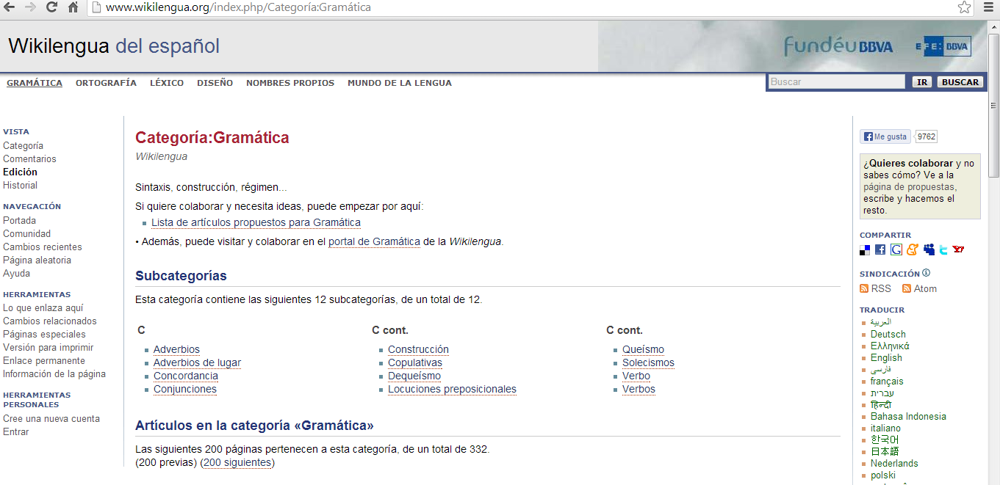
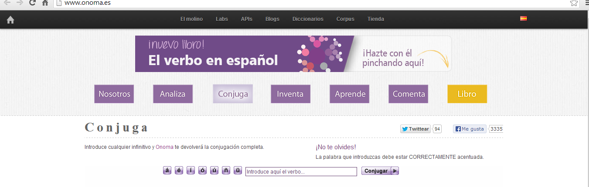
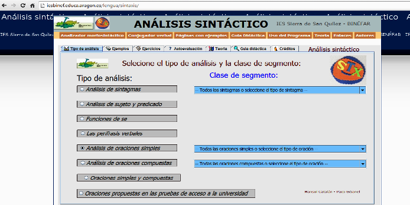

# Gramática

**Gramática**

**Enciclopedia de lengua española**

*   **[WIKILENGUA](http://www.wikilengua.org/index.php/Portada)**

Es un wiki para compartir información práctica y normativa sobre el idioma español. Está pensado como un sitio abierto y participativo para compartir información práctica sobre la norma, el uso y el estilo del español y un medio para reflejar la diversidad de una lengua hablada por cientos de millones de personas. 

**Conjugadores verbales**

*   [http://www.onoma.es/](http://www.onoma.es/)

*   [http://www.gedlc.ulpgc.es/investigacion/scogeme02/flexver.ht](http://www.gedlc.ulpgc.es/investigacion/scogeme02/flexver.htm)
*   [http://www.verbolog.com/conjuga.htm](http://www.verbolog.com/conjuga.htm)

**Análisis morfosintáctico**

*   **[http://recursos.cnice.mec.es/analisis_sintactico/repaso3.php?enlace=1&prev=3](http://recursos.cnice.mec.es/analisis_sintactico/repaso3.php?enlace=1&prev=3)**
*   **[http://www.analisissintactico.com/](http://www.analisissintactico.com/)**
*   **[http://iesbinef.educa.aragon.es/lengua/sintaxis/](http://iesbinef.educa.aragon.es/lengua/sintaxis/)**

