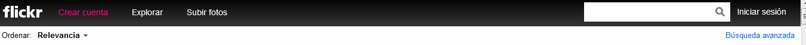
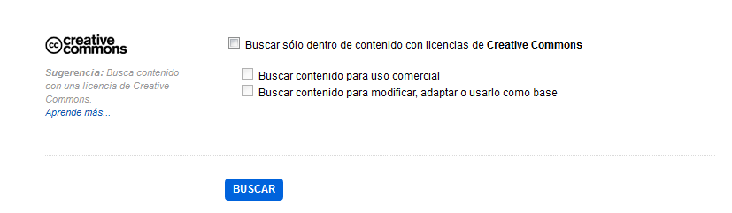
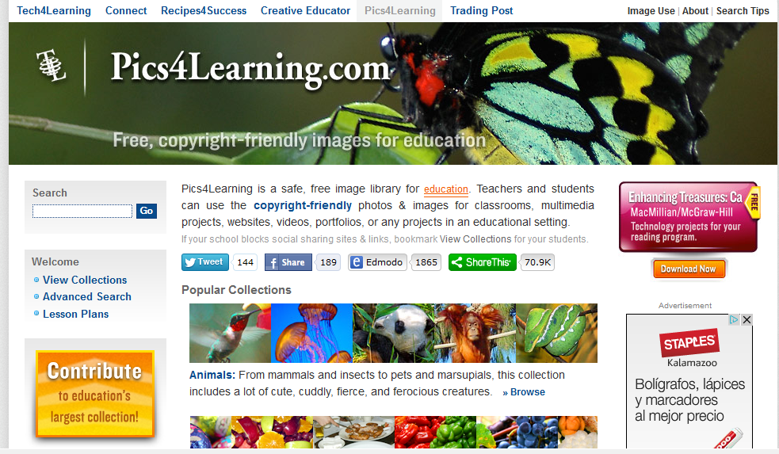

# Imágenes

Existen varios servicios  que nos permiten buscar imágenes con licencias flexibles que facilitan su reutilización:

*   **Flickr**([http://www.flickr.com](http://www.flickr.com/)) 

En la  parte superior izquierda de la página principal si se pulsa en "Búsqueda" y después en "Búsqueda avanzada"

se accede a contenido con licencias Creative Commons

*   **Google Images** ([http://images.google.com](http://images.google.com/) )

Como en el caso anterior, se accede a la opción búsqueda avanzada. Desde ahí se puede elegir el tipo de licencia con el que quieres encontrar tus recursos.

*   **Pics4learning** ([http://www.pics4learning.com](http://www.pics4learning.com))

Es una página con colecciones de imágenes ordenadas en categorías, con licencia para su uso educativo por profesores y estudiantes. 

*   **Morguefile** ( [http://www.morguefile.com](http://www.morguefile.com))

 Es un repositorio de imágenes publicadas bajo un tipo de licencia especial (morguefile license)  que permite su modificación, su uso comercial y su utilización sin citar autor, siempre y cuando la imagen sufra alguna modificación y el usuario/distribuidor no se atribuya la propiedad de la obra original.

