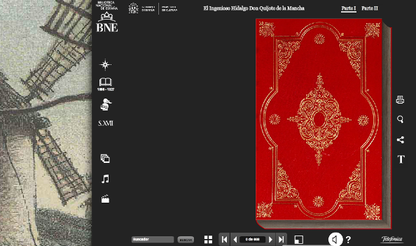
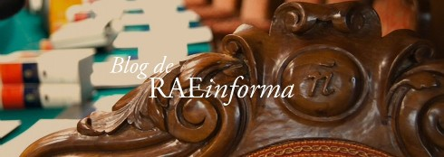

# Módulo 1: EL BLOG COMO MEDIO DE COMUNICACIÓN

**Lengua castellana y Literatura con las  TIC **

Este curso pretende dar a conocer diferentes  recursos que ayuden al profesorado de Lengua en el desarrollo de sus clases  y en el enriquecimiento de los procesos de enseñanza haciendo uso de las TIC.

Se ha diseñado con la intención de que el profesorado conozca el manejo básico de algunas herramientas TIC útiles en el aula de Lengua castellana y Literatura, al tiempo que se van perfilando aplicaciones concretas. Así, se pretende presentar diferentes propuestas que sirvan al profesorado para descubrir nuevos recursos que implican a su vez nuevas formas de enseñar y aprender.

Todos los materiales se pueden utilizar en los diferentes niveles de Lengua tanto  de Primaria, como de  Secundaria y Bachillerato. 

Lo primero que queremos presentar es el **Blog** como herramienta  de  comunicación, porque su uso incentiva la generación de ideas y su puesta en común, así como  la colaboración.

 

## Objetivos

*    Conocer los diferentes servicios para la confección de blogs.
*    Utilizar las herramientas necesarias para la confección de un blog en Blogger, Arablogs o en WordPress.
*    Aprender a gestionar un blog.
*    Aprender a usar blogs y a integrarlos en la práctica docente del aula de Lengua Castellana.
*    Compartir los recursos educativos publicados en un blog.
*    Intercambiar experiencias y puntos de vista.
*    Crear comunidad con otros blogs de profesores/as.

