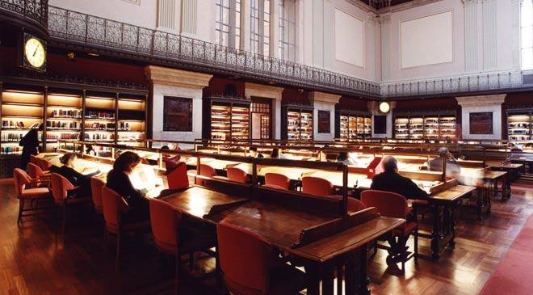

# 2. BUSCANDO INFORMACIÓN EN INTERNET

El   crecimiento del volumen de información disponible en Internet hace necesario que se conozcan  los mejores y más seguros  mecanismos de navegación,  búsqueda y selección.  

En el trabajo diario, el profesor debe  buscar, seleccionar y utilizar recursos Web. Familiarizarse  con buscadores en Internet es imprescindible, para que esa información pueda ser utilizada en cualquier momento y con la máxima fiabilidad.

Esa fiabilidad la proporcionan instituciones como La Biblioteca Nacional que cuenta, entre sus servicios, con  la [Biblioteca digital Hispánica ](http://www.bne.es/es/Catalogos/BibliotecaDigitalHispanica/Inicio/index.html) donde se hallan  fondos digitalizados  de la misma, que pueden ser muy útiles para los profesores de Lengua castellana y Literatura.  Es solo un ejemplo de lo que podemos encontrar en Internet y que nos será de gran utilidad para la práctica docente.    

## Objetivos

*   Aprender a navegar en Internet de forma segura y a hacer búsquedas.
*   Utilizar buscadores generales y metabuscadores.
*   Acceder a recursos textuales, imágenes, sonidos y vídeos abiertos.
*   Saber cómo administrar recursos e información encontrados en Internet.
*   Cotejar la fiabilidad de la información obtenida. 

