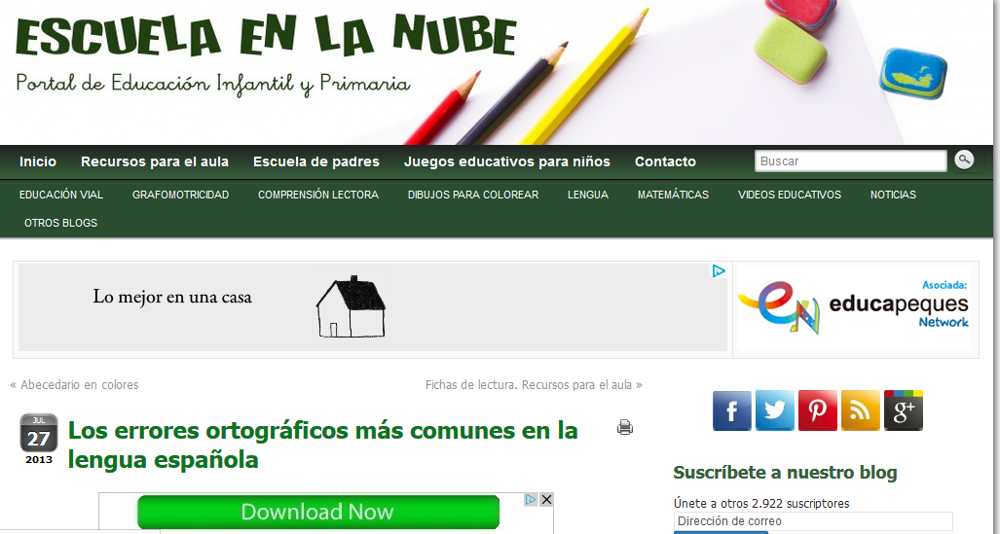
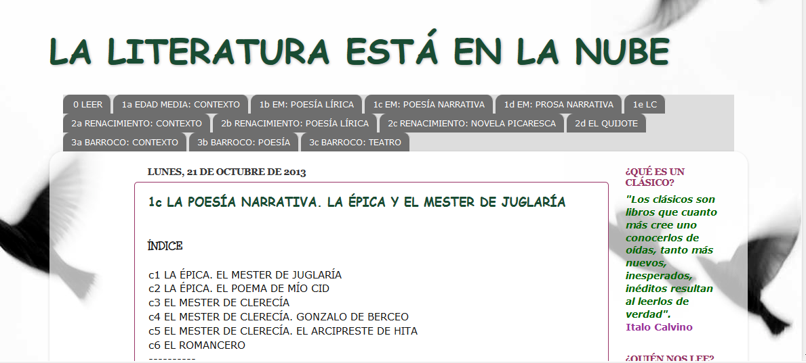

# Módulo 3: PRESENTACIONES Y TRABAJO COLABORATIVO CON RECURSOS DE LA RED

**Lengua castellana y Literatura con las  TIC **

Las presentaciones  sirven para mostrar  los contenidos de manera dinámica y  motivadora. Esos recursos y otros elaborados por los profesores pueden ser compartidos  con distintas herramientas que proporciona Internet: “la nube de Internet”.  

Trabajar   temas en torno a los programas de ofimática y  crear producciones propias que pueden ser almacenadas y  compartidas en la red es fundamental para la labor docente de los profesores de Lengua castellana y Literatura.

 

 Fig. 3.1 _Página de inicio de la Escuela en la nube_                                     Fig. 3.2 _Página de inico de la Literatura en la nube_

      [http://www.escuelaenlanube.com/](http://www.escuelaenlanube.com/)                                        [http://laliteraturaestaenlanube.blogspot.com.es/](http://laliteraturaestaenlanube.blogspot.com.es/)

## Objetivos

Los objetivos específicos:

  
• Conocer el uso de los programas de presentaciones Power Point o Impress.  
• Crear presentaciones sencillas para mostrar trabajos y modelos de proyecto en el aula de Lengua Castellana y Literatura.  
• Insertar imágenes en una presentación ya configurada.  
• Insertar sonidos en una presentación ya configurada.  
• Identificar las utilidades de la aplicación Google Drive.  
• Utilizar de manera correcta Google Drive.  
• Aplicar diferentes estrategias didácticas de trabajo colaborativo en el aula de Lengua y Literatura Castellana utilizando Google Drive para facilitar los aprendizajes.  
• Aplicar diferentes estrategias didácticas de trabajo colaborativo en el aula de Lengua y Literatura Castellana utilizando Slideshare.  
• Compartir presentaciones mediante el uso de otros formatos y páginas web como Scrib o Issuu.  
• Registrar las creaciones propias con Creative Commons.

