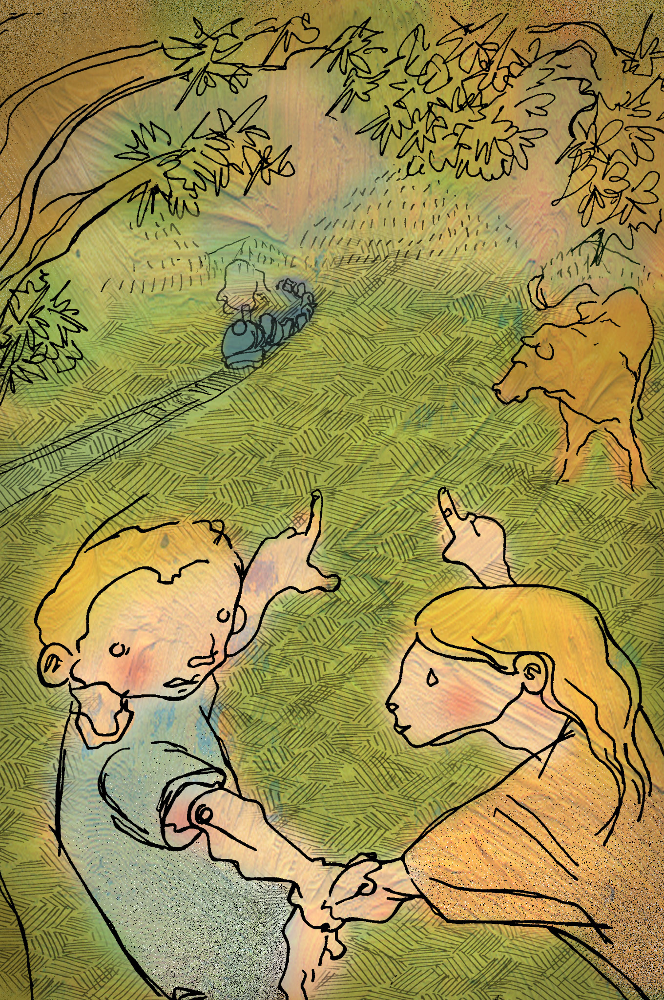

# ITE

**Banco de Imágenes y sonidos del ITE. ([http://recursostic.educacion.es/bancoimagenes/web/](http://recursostic.educacion.es/bancoimagenes/web/))**

Un recurso de gran utilidad es el Banco de Imágenes y sonidos del ITE. La licencia de todos los recursos disponibles, que incluyen también vídeos, animaciones e ilustraciones, es específica para el uso educativo no lucrativo y requiere el reconocimiento de la fuente.   
  
Además de realizar una búsqueda por un término concreto como la que se muestra en la ilustración, que nos ha ofrecido como resultado fotografías, sonidos, una ilustración y un vídeo, se pueden realizar las búsquedas por un tipo concreto de media. Puede utilizarse una búsqueda por niveles educativos y materias, así como por colecciones. 

