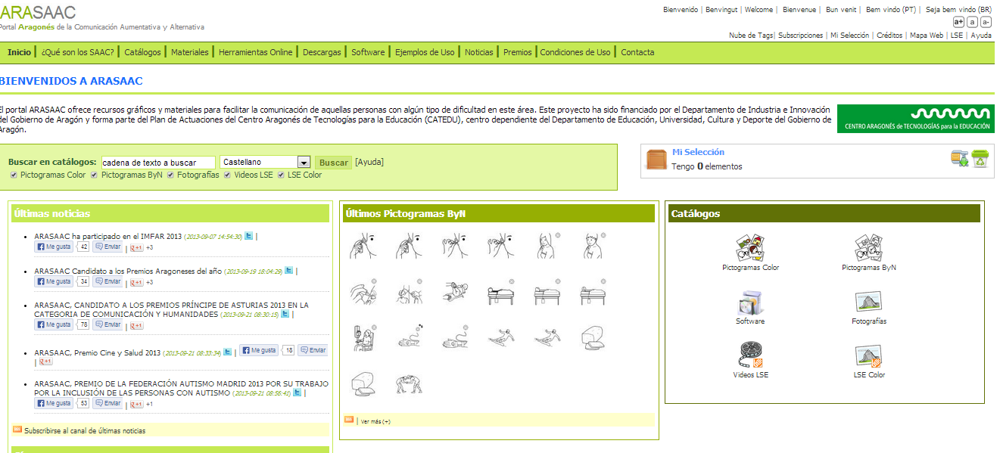
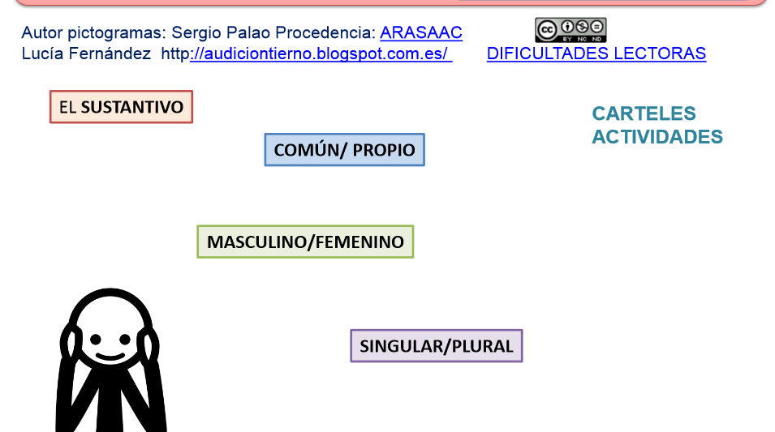

# Pictogramas

**Pictogramas**

*   **Portal Aragonés de la Comunicación Aumentativa y Alternativa** ( [http://www.catedu.es/arasaac/](http://www.catedu.es/arasaac/) )

Este portal  ofrece recursos gráficos y materiales para facilitar la comunicación de aquellas personas con algún tipo de dificultad en esta área. Contiene más de 14.500 pictogramas y miles de materiales elaborados por profesionales a partir de estos.

 

                                         Fig. 2.14 _Página de inicio de ARASAAC_

Un ejemplo de materiales que podemos encontrar  es el siguiente:

Fig. 2.15 _Gramática adaptada (ARASAAC)_

