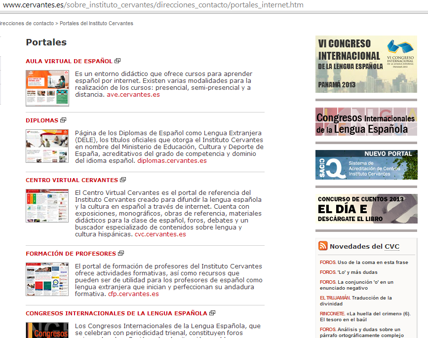
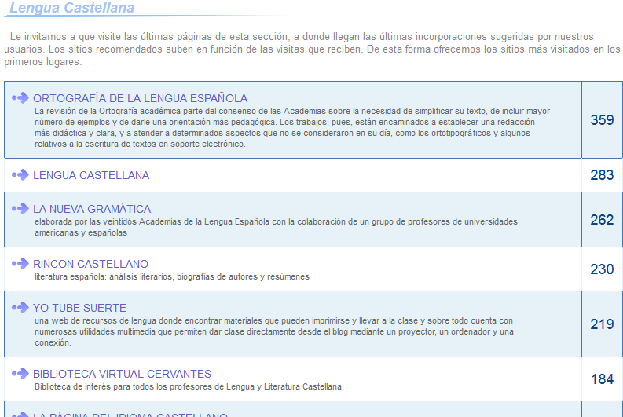
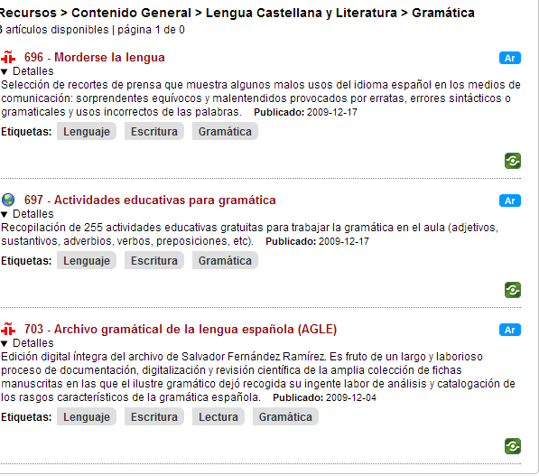
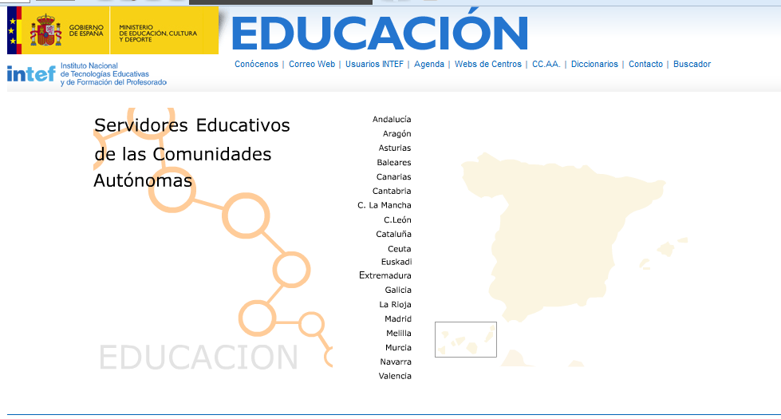

# Portales de Portales

**Portales de portales**

*   **[Portales educativos en el Instituto Cervantes](http://www.cervantes.es/sobre_instituto_cervantes/direcciones_contacto/portales_internet.htm)**

****

                          Fig. 2.29 _Portales del Instituto Cervantes_

*   **[Portales educativos en EDUCASITES](http://www.educasites.net/)**

****

                       Fig. 2.30  _Páginas de Lengua castellana_

*   **[Portales educativos en EDUTEKA](http://www.eduteka.org/directorio/index.php?t=sub_pages&cat=208)**

****

            Fig. 2.31  _Recursos de Lengua castellana_

*   **[Portales educativos de las Comunidades Autónomas en ISFTIC](http://ntic.educacion.es/w3/ccaa/index.html)**

****

            Fig. 2.32 _Portales de las Comunidades Autónomas_

*   **[Portales educativos (Pere Marqués)](http://www.pangea.org/peremarques/websinteres.htm)**

Incluye, como los anteriores, referencias a portales educativos como Agrega2, o a los de las respectivas Comunidades Autónomas.

*   **[Portales educativos de la OEI](http://www.oei.es/tic/portales.htm)**

En este portal se encuentran enlaces a los distintos Ministerios de Educación de los países iberoamericanos y  a  portales educativos que se encuentran integrados en la Red RELPE (La Red Latinoamérica de Portales Educativos).

