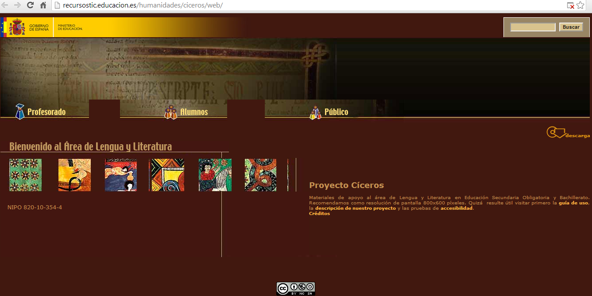
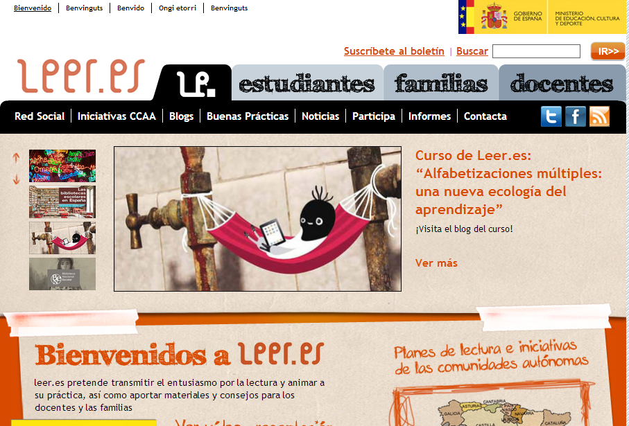
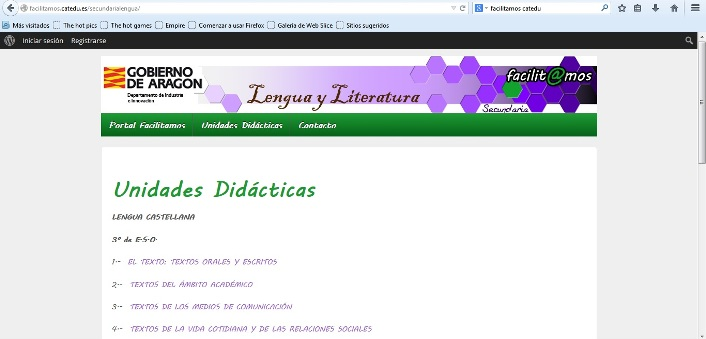

# Portales educativos

*   [Centro Virtual Cervantes](http://www.cvc.cervantes.es/portada.htm)

El Centro Virtual Cervantes ofrece materiales y servicios para los profesores de español, los estudiantes, los traductores, los periodistas y otros profesionales que trabajan con la lengua, así como para los hispanistas de todo el mundo.  El sitio está organizado en cinco grandes secciones: Enseñanza, Literatura, Lengua, Artes y Ciencia. También mantiene sus portales asociados: el Aula Virtual de Español, el portal de los Congresos Internacionales de la Lengua Española, y los de la radio y la televisión por internet del Instituto Cervantes.

*   [Ministerio de Educación, Cultura y Deporte : PROYECTO CICEROS](http://recursos.cnice.mec.es/lengua/index.html)

Materiales de apoyo al área de Lengua y Literatura en Educación Secundaria Obligatoria y Bachillerato.

*   [El Rincón del castellano](http://www.rinconcastellano.com/)

Página con apuntes, resúmenes, biografías y trabajos de Literatura.

*   [El Castellano.Org. La página del idioma español](http://www.elcastellano.org/)

La Página del Idioma Español es una revista digital que fomenta el idioma español en  Internet. Sus secciones están relacionadas con Lingüística.

*   [Leer.es](http://leer.es/)

Fomenta la lectura y anima a su práctica, también aporta materiales y consejos para los docentes y las familias.

*   [**Facilitamos.catedu.es**](http://facilitamos.catedu.es/)

En este  nuevo portal de Catedu se están incluyendo Unidades didácticas con sus correspondientes propuestas didácticas, de todas las materias y, en concreto, de tercer ciclo de primaria de [Lengua castellana y Literatura](http://facilitamos.catedu.es/primarialengua/), así como de [3º de ESO de Secundaria](http://facilitamos.catedu.es/secundarialengua/).

