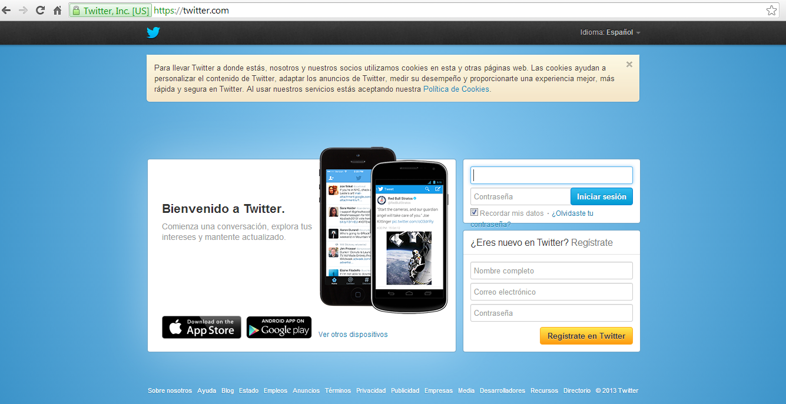

# Twitter

**Twitter**

 Para crear una cuenta en Twitter lo primero que hay que hacer es ir a la página oficial [https://twitter.com/](https://twitter.com/)

y registrarse

                             

 A continuación puedes seguir los pasos que te indica este sencillo tutorial

 Vídeo 3.  [Manual Twitter 2013. Primeros Pasos](https://www.slideshare.net/Walnuters/manual-twitter-2012-primeros-pasos "Manual Twitter 2013. Primeros Pasos") 

Para conocer los posibles usos de Twitter en educación véase [http://www.eduteka.org/TwitterEducacion.php](http://www.eduteka.org/TwitterEducacion.php)

Otra opción interesante es la [plantilla “P2”](http://casitwitter.wordpress.com/) que ofrece WordPress y que simula la interfaz de Twitter. Tal como lo comenta [Juan José de Haro](http://eduredes.ning.com/forum/topics/experiencias-en-el-uso-de), esta plantilla puede resultar muy conveniente para aquellos docentes que desean mantener la privacidad de sus estudiantes con el uso cerrado de un blog, pero de manera que este se comporte como si estuvieran en una sesión privada de Twitter. 

**Seguridad y privacidad en Twitter**

Twitter no permite el registro a menores de 13 años. Es una red social que apenas recopila información sobre los usuarios. Los problemas derivados de la seguridad y privacidad dependerán entonces de lo que se publique a través de ella más que de los datos que los demás puedan ver de nosotros. Básicamente bastará con proporcionar un nombre de usuario, una contraseña y la dirección de correo. El resto de opciones (que son muy pocas) no son obligatorias.

Salvo que tengamos protegidos los tweets (algo que, en general, no se recomienda en esta red) todo lo que se escriba en Twitter será de acceso público.

Una vez registrados podremos modificar las opciones que afectan a nuestra privacidad pulsando sobre el icono que hay en la parte superior derecha con la figura de una persona y seleccionando la opción **Configuración**.

  

En el apartado **cuenta** podremos hacer los tweet privados (opción **Proteger mis Tweets**) aunque es algo desaconsejable ya que esta red se basa en la apertura a sus miembros y la privacidad de los tweet hará que mucha gente no te siga. Si vamos a escribir cosas que no deseamos que vea cualquiera probablemente será preferible crear dos cuentas, una para uso privado (familia, amigos, grupos privados, etc.) y otra para uso profesional que será abierta.

Aconsejamos el uso de la conexión segura HTTPS de forma que la comunicación con Twitter estará siempre encriptada. No aconsejamos marcar la opción Añade una ubicación a mis tweets ya que en ese caso se podrá saber nuestra localización exacta a través de nuestros mensajes (siempre que el dispositivo que usemos para escribir en Twitter lo permita).

En la sección **Perfil**  podremos modificar nuestro nombre, nombre de usuario, ubicación, página web o biografía. También podremos conectar nuestra cuenta de **Twitter a Facebook** de forma que todo lo que escribamos en la primera aparecerá de forma automática en la segunda. En el caso de que decidamos conectar las dos redes deberemos tener especial precaución ya que nuestros mensajes pueden ir a parar a personas muy diferentes de las que nos siguen por Twitter. Es frecuente eliminar un tweet poco afortunado y olvidarse de hacer lo mismo en Facebook, con lo que el mensaje original seguirá estando en Internet. En cualquier momento podremos desligar ambas redes pulsando sobre **Desconectar**.

       6.8   _Imagen tomada de Juan José de Haro_

**Para darse de baja** hay que acceder a los datos de nuestra cuenta, pulsando sobre **Configuración > Cuenta**. En la parte inferior de la página, encontraremos el enlace **Desactivar mi cuenta**. Tras pulsarlo, se nos informa de que la cuenta se desactiva durante 30 días, durante los que podremos recuperarla simplemente iniciando sesión, pero pasado ese tiempo será totalmente eliminada. Para confirmarlo sólo deberemos pulsar el botón **Bien, de acuerdo, desactivar**.

Véase, [http://www.wikisaber.es/comunidadwiki/blogs/blogpost.aspx?id=15001&blogid=63860](http://www.wikisaber.es/comunidadwiki/blogs/blogpost.aspx?id=15001&blogid=63860)

