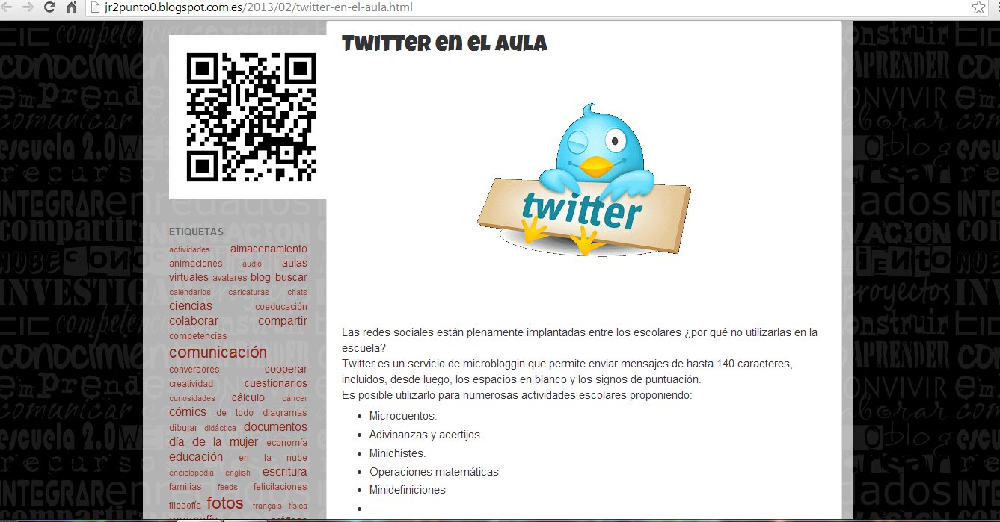

# Twitter para docentes

Como toda herramienta que favorece la comunicación, Twitter puede utilizarse en el ámbito educativo   ya que facilitará la interacción entre profesorado y alumnado. 

Vídeo 4. [http://prezi.com/vf_q6wpxf0rj/herramientas-para-docentes-en-twitter/#](http://prezi.com/vf_q6wpxf0rj/herramientas-para-docentes-en-twitter/#)

Véase [http://www.examtime.es/twitter-en-el-aula/](http://www.examtime.es/twitter-en-el-aula/)

 Unas recomendaciones muy interesantes para utilizar Twitter en el aula las podemos encontrar en 

[http://jr2punto0.blogspot.com.es/2013/02/twitter-en-el-aula.html](http://jr2punto0.blogspot.com.es/2013/02/twitter-en-el-aula.html)

Fig. 6.9 _Twitter en el aula_

