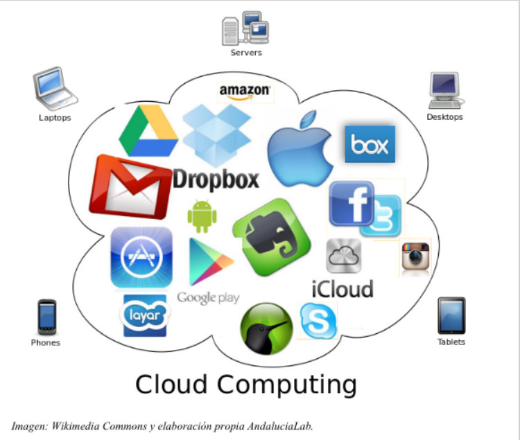

# U.1 GUARDAR Y COMPARTIR MATERIALES

Las posibilidades que Internet nos ofrece para guardar nuestros materiales en la nube pueden ser aprovechadas para que sean  una prolongación de la clase y del trabajo en el aula, facilitando la comunicación entre los alumnos y el profesor fuera del centro. 

  
Las utilidades que podemos extraer  para la enseñanza de Lengua castellana y Literatura son las siguientes:

*    Implicación de los alumnos/as en una tarea común que integre lectura, escritura, etc.
*    Comunicación inmediata entre profesor-alumno o alumno-alumno para resolver dudas de clase, ejercicios, etc.
*    Corrección y evaluación directa de las tareas por parte del profesor.
*    Debates virtuales sobre un asunto de clase en el que se incluyen las conclusiones y valoraciones de los alumnos/as.
*    Creación de un nuevo documento en clase y reedición del mismo en casa, lo que permite hacer trabajo continuado por parte del alumno.
*   Publicar los propios trabajos para compartirlos con el resto de compañeros produciéndose un aprendizaje recíproco.

