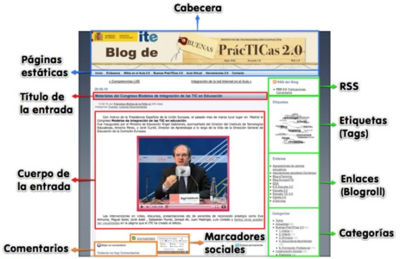

# U.1 LOS BLOGS

El  blog (bitácora en su traducción al castellano), está formado por una serie de artículos o entradas clasificadas por fechas, en el que el artículo más reciente se muestra en primer lugar.

El autor o blogger escribe en su blog con una cierta periodicidad nuevos textos. Generalmente, se especializan en determinados temas de tal forma que los lectores pueden seleccionar el blog que desean consultar según sus intereses. 

Si su autor lo permite, los lectores pueden dejar comentarios a los textos que aparecen en el blog, que a su vez pueden ser contestados por el propio autor, creando así un diálogo entre lectores y autor que enriquece especialmente el intercambio de ideas.

En definitiva, el **Blog** es un medio fundamental  para compartir información.

**1\. ¿Cuál es la estructura de un blog?**

La estructura de un blog es bastante estándar y suele mantenerse sea cual sea el proveedor de servicios.

 

                                      Fig. 1.3 _ Elementos de un blog. Ite_

**Muchos son los usos didácticos que pueden tener los blogs. Para muestra un botón**

Video 1. _II Encuentro de blogs educativos._ [http://vimeo.com/38116481](http://vimeo.com/38116481)

