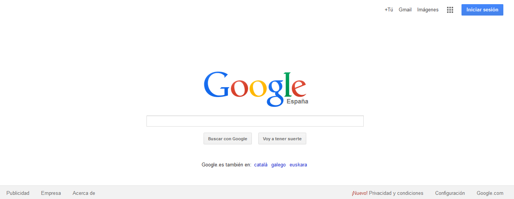
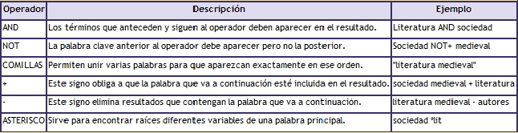
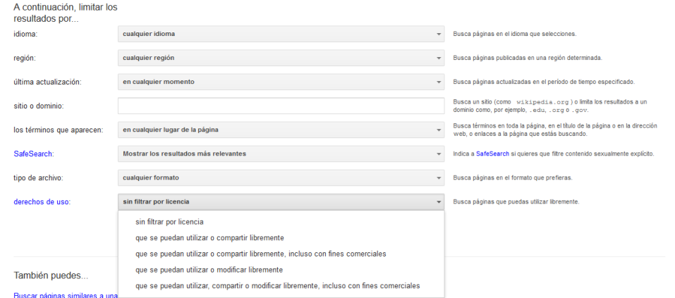

# U.1 LOS BUSCADORES COMO MOTORES DE BÚSQUEDAS. RECURSOS ABIERTOS

**1\. Buscadores generales**

  
Para encontrar información en Internet podemos utilizar algunas páginas web llamadas buscadores.  
Las páginas web clasificadas por los buscadores se incorporan a ellos de forma automática. Por ello, muchas veces las páginas cambian su contenido, su dirección o ya no están en línea, pero continúan clasificadas por el buscador hasta que su programa de búsquedas renueve la información.

Algunos de los buscadores generales más conocidos son: [Google](https://www.google.es/), [Yahoo](http://es.yahoo.com/).

Figura 2.3  _Página de inicio del buscador Google_

**2\. Estrategias de búsqueda**

*   **Escribir las palabras clave**

Son aquellas palabras o términos que usamos para describir los conceptos o ideas que buscamos. En Internet se consideran distintas las mayúsculas de las minúsculas. Si se teclea cualquier palabra con mayúscula se fuerza a emparejar exactamente con la palabra entera. Hay que vigilar la ortografía y combinar sinónimos para que la búsqueda sea más efectiva.

*   **Operadores de búsqueda  **

Los operadores de búsqueda sirven para especificar más la búsqueda, a fin de encontrar la información deseada. Puedes escribir solo uno o hacer combinaciones con todos ellos.

Fig. 2.4_    Operadores de búsqueda_

*   **Configuración para poder encontrar contenido con las licencias libres.  Las herramientas de Google: búsqueda avanzada **

Dado que Google es el buscador  que se utiliza habitualmente,  se pueden filtrar los resultados basándose en el tipo de licencia. 
Para ello, desde la página principal del buscador, seleccionaremos "Búsqueda avanzada", iremos a derechos de uso y una vez ahí escogeremos la licencia más adecuada [http://www.google.es/advanced_search](http://www.google.es/advanced_search)

 

Fig. 2.5   _ Búsqueda avanzada en Google_

** 3\. Recursos abiertos**

Los recursos que están en la red  tienen unos autores cuyos derechos morales y patrimoniales hay que respetar.
 Pero  muchos de esos autores no desean reservarse todos los derechos sobre sus obras, sino que prefieren ponerlas a disposición del público bajo unas determinadas condiciones. Es necesario, cuando nos servimos de recursos elaborados por otras personas, citar y reconocer la autoría de los trabajos que se utilizan.

