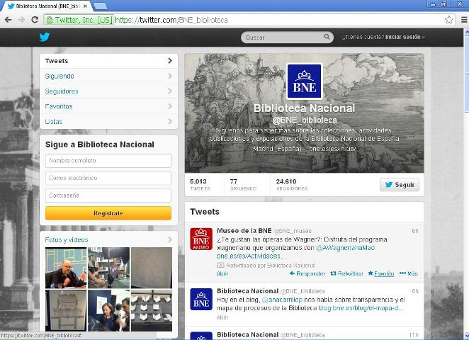
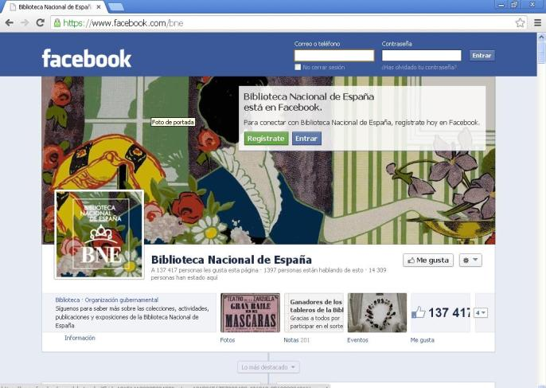

# U.1 ¿QUÉ SON LAS REDES SOCIALES?

**1\. Las redes sociales**

Se denominan redes sociales a  aquellos servicios de Internet especializados en permitir y fomentar relaciones entre las personas.

Las redes sociales son servicios que tienen su escenario en Internet. La mayor parte  tiene funciones  muy parecidas, que se pueden utilizar a través del interfaz de usuario y de acuerdo con unas condiciones de uso predeterminadas. El usuario y las condiciones definen y ponen límites al tipo de relaciones que se pueden desarrollar entre los usuarios y a las acciones que estos pueden realizar.  Los servicios de redes sociales proporcionan ciertas opciones de configuración, entre las que destacan, por su importancia, las que tienen que ver con la privacidad de los datos que forman parte del perfil del usuario (público, semipúblico, solo visible para los “amigos”, etc.) y con la conexión con otros usuarios del mismo servicio.

         

 Teniendo en cuenta la función que desempeñan  las redes sociales es evidente su utilidad en el ámbito educativo:

Vídeo 2. _Qué son las redes sociales y su posible uso educativo [http://www.youtube.com/watch?v=BAAoZPZk8uA](http://www.youtube.com/watch?v=BAAoZPZk8uA)_

