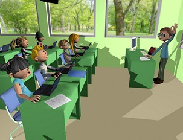

# U.1 ¿QUÉ SON LAS WEBQUEST?

**1\. Las webQuest**

WebQuest es un modelo de aprendizaje extremamente simple y rico para propiciar el uso educativo de Internet, basado en el aprendizaje cooperativo y en procesos de investigación para aprender.

Un WebQuest es una actividad enfocada a la investigación, en la que la información usada por los alumnos es, en su mayor parte, descargada de Internet. Básicamente es una exploración dirigida, que culmina con la producción de una página Web, donde se publica el resultado de una investigación.

WebQuest es una metodología de aprendizaje basado fundamentalmente en los recursos que nos proporciona Internet que incitan a los alumnos a investigar, potencian el pensamiento crítico, la creatividad y la toma de decisiones, contribuyen a desarrollar diferentes capacidades llevando así a los alumnos a transformar los conocimientos adquiridos.

 Véase [http://platea.pntic.mec.es/~erodri1/QUE%20ES.htm](http://platea.pntic.mec.es/~erodri1/QUE%20ES.htm)

                   

 Con este tutorial se pueden conocer todos los entresijos de una WebQuest 

                                                                     Vídeo 2. Tutorial sobre WebQuest 

