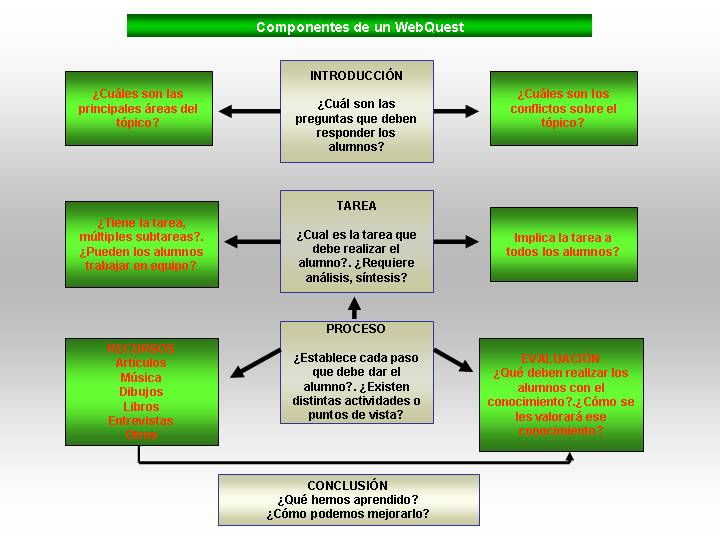

# U.2 COMPONENTES DE UNA WEBQUEST

Los componentes básicos de una WebQuest son: una**introducción**clara, sucinta, que proporcione la información necesaria para iniciar la actividad; una**tarea**central interesante y concreta; una colección de**recursos**(sitios web fundamentalmente) donde encontrar la información necesaria; una descripción paso a paso del**proceso**que se utilizará para la tarea, pautas para organizar la información adquirida (preguntas que deben ser contestadas, etc.); la **evaluación**de la actividad; una**conclusión**que repase lo que han aprendido los alumnos y cómo puede ser aplicado en otros temas y por último la evaluación del trabajo de los alumnos.

 Te ofrecemos un resumen de las partes de que se componen una WebQuest 

Vídeo 3.  [Componentes de una WebQuest](https://www.slideshare.net/arrabalde/componentes-de-una-webquest "Componentes de una WebQuest") 

**1\. Introducción**

 La introducción tiene dos objetivos:

a) Orientar al alumno sobre lo que se va a encontrar.

b) Incrementar su interés por la actividad.

**2.Tarea**

En este apartado se proporciona al alumno una descripción que tendrá que haber hecho al finalizar el ejercicio. Puede ser una presentación con PowerPoint, o tal vez una presentación verbal en la que pueda ser capaz de explicar un tema específico.

**3\. Proceso**

En este apartado se sugieren los pasos que los alumnos deben seguir para completar la tarea así como una descripción de los papeles o perspectivas que los alumnos deben adoptar. El profesor puede también añadir orientaciones sobre el aprendizaje. La descripción del proceso debe ser breve y clara.

 **4.Recursos**

En esta sección se proporciona una lista de páginas web que el profesor ha localizado previamente y que ayudarán a los alumnos a realizar la tarea. La preselección de este tipo de recursos permite que los alumnos se centren en el tema, en lugar de navegar por la red "sin rumbo". Los recursos no tienen por qué estar restringidos a Internet.

**5\. Evaluación**

 Dependiendo del nivel de los alumnos y del tipo de actividad se hará una descripción de lo que se va a evaluar y de cómo se hará.

**6\. Conclusión**

Esta sección proporciona la oportunidad de resumir la experiencia, animar a la reflexión sobre el proceso y generalizar lo que se ha aprendido. No es una parte crítica de todo el conjunto, pero proporciona un broche (mecanismo de cierre) a la actividad. Puede ser interesante, en esta sección, sugerir preguntas que un profesor podría hacer en una discusión abierta con toda la clase.

               Fig. 5.2 _ Componentes de una WebQuest_

 [http://nntt-educacion.wikispaces.com/file/view/componentes-de-un-webquest%5B1%5D.jpg/127479011/820x643/componentes-de-un-webquest%5B1%5D.jpg](http://nntt-educacion.wikispaces.com/file/view/componentes-de-un-webquest%5B1%5D.jpg/127479011/820x643/componentes-de-un-webquest%5B1%5D.jpg)

