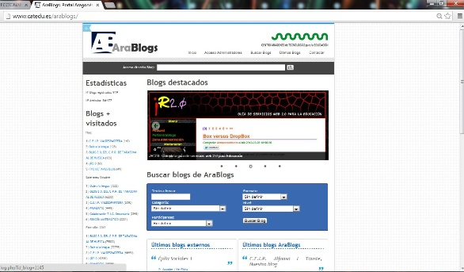
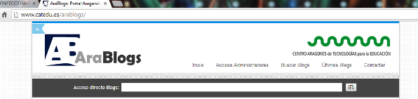
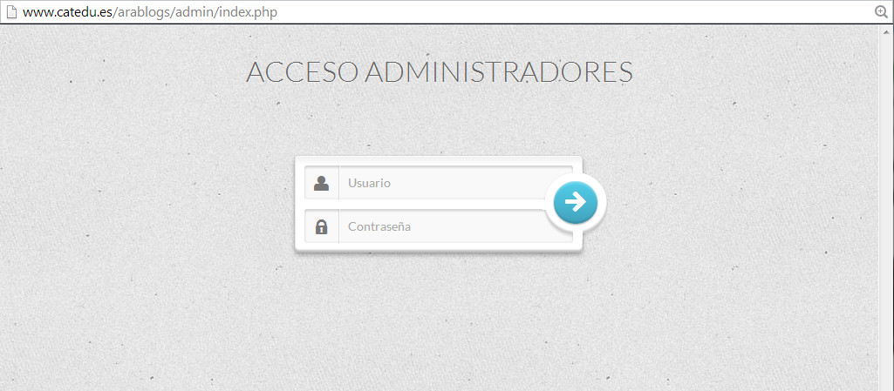

# U.2 CONFECCIONAR UN BLOG CON ARABLOGS

Crear un blog en Arablogs es muy sencillo. Hay que acceder al Portal de AraBlogs, para ello  escribimos en la barra de direcciones de nuestro navegador de Internet: [http://www.catedu.es/arablogs/](http://www.catedu.es/arablogs/) y se nos mostrará esta pantalla:

                                                    Fig. 1.4  _Página de inicio de AraBlogs_

**1\. Zona de acceso al blog  
**

En la parte superior de la página principal se encuentra la zona de acceso directo.

 

                           Fig.1.5 _Zona de acceso a los blogs_

Simplemente con escribir la primera letra por la que crees que empieza el nombre de un Blog se te mostrarán, en un menú emergente, todos los que comienzan por esa letra. Si pulsamos sobre el nombre, accedemos directamente al Blog. Este puede ser uno de los modos de acceso a tu blog, no sólo para ti sino también para tus alumnos.

**2\. Acceso de administradores**

Para poder crear un blog en AraBlog y ser administrador del mismo, hay que solicitarlo directamente en AraBlog a través del formulario de contacto o a través de los asesores TIC de los CIFES.

Después de recibir el nombre de usuario y contraseña, podrás acceder a la zona de acceso de administradores, crear tu blog y administrarlo.

 Fig. 1.6_   Acceso a administradores_

Antes de acceder al blog para administrarlo, aparece el protocolo de publicación de CATEDU que hay que aceptar. 

**3\. Creación de nuestro blog  
**

Para confeccionar el blog y darle un carácter personal, así como para aprender a editar categorías,  artículos, insertar imágenes, vídeos e hipervínculos es necesaria la lectura del [Manual de AraBlogs](http://www.catedu.es/facilytic/2013/10/16/manuales-y-tutoriales-de-arablogs/). Siguiendo sus indicaciones dominaréis fácilmente el blog.

Fig. 1.7 Antiguos y modernos.  [http://www.flickr.com/photos/notionscapital/2304267496/](http://www.flickr.com/photos/notionscapital/2304267496/)

