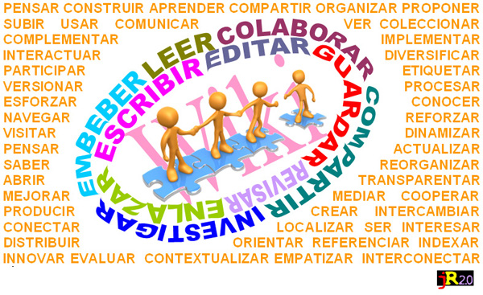

# U.2 CREACIÓN DE WIKIS

A la hora de crear un wiki, se puede optar por servicios de alojamiento gratuito o bien por gestores de contenidos especializados en la creación y administración de este tipo de sitios web. Existen multitud de plataformas para crear un wiki, cada plataforma utiliza un método concreto para editarlo y tiene sus propias ventajas y desventajas. 

Dos de entre los servicios más populares en el ámbito educativo son [Google Sites](http://sites.google.com/) y  [Wikispaces](http://www.wikispaces.com/ "Wikispaces").

 

