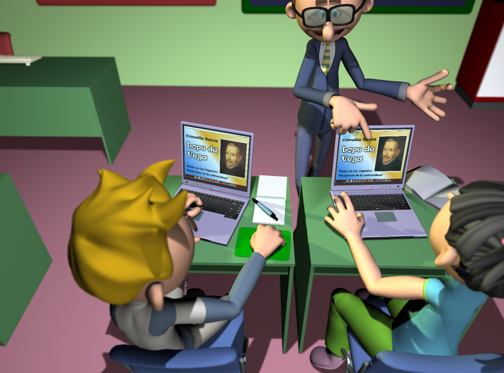

# U.2 ELABORAR UNA PRESENTACIÓN CON POWERPOINT O IMPRESS

Las presentaciones son  herramientas de ofimática que ofrecen múltiples posibilidades para explicar los temas de Lengua castellana y Literatura de una manera dinámica, ofrecer a los alumnos/as resúmenes y proponerles actividades de forma  motivadora.

Resulta evidente que las presentaciones tienen otras funciones, además de las de tipo didáctico dentro y fuera del aula. El profesorado  iniciado  en las tecnologías de la información y la comunicación sabe que estas se adecuan a cualquier necesidad que surja dentro del amplio espectro de la comunidad educativa. Además, podrás compartir tus presentaciones en distintas webs. 

Fig. 3.6 _Uso didáctico de las TIC_

