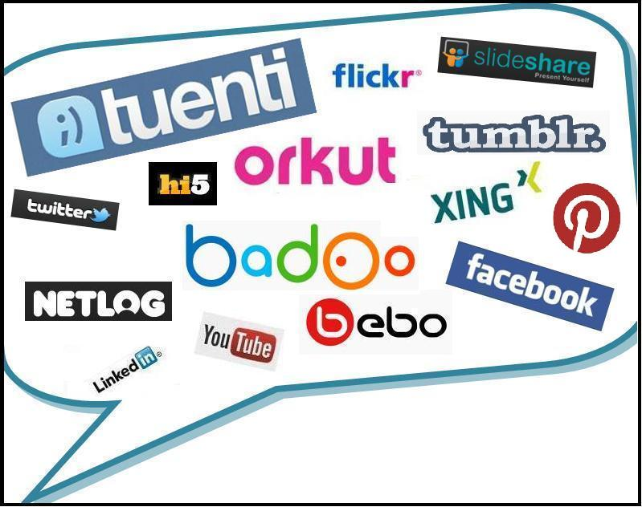

# U.2 FUNCIONAMIENTO DE LAS REDES SOCIALES

Las redes sociales poseen unas propiedades similares en cuanto a funciones y utilidad. Las relaciones que se crean y mantienen a través de ellas se desarrollan mediante las posibilidades de ejecución que instaura el sitio web, determinadas, a su vez, por el interfaz del usuario. Las posibilidades de actividad son las mismas para todos los usuarios, por ejemplo, cada uno de ellos puede agregar los contactos que desee a su lista, pero todos tienen un límite establecido. Las redes sociales permiten a sus miembros mostrar preferencias, fotografías, vídeos o estados, pero supeditados a las condiciones de uso y funciones de la red social. De igual manera, las opciones de configuración de cuenta y privacidad proporcionan a los usuarios alternativas de búsqueda de amigos, conexión con otros miembros y visibilidad personal, personalizando así su implicación en la red, aunque, igualmente, dentro de unas condiciones predeterminadas.

El funcionamiento de las redes sociales se establece mediante las acciones de los usuarios, que interactúan de manera multidireccional a través de la misma. Con el registro y la creación de una cuenta, el usuario personaliza un perfil, y envía solicitudes a otros individuos de la red para establecer una conexión a través de ella. Los usuarios que aceptan la solicitud se convierten en miembros de la lista de contactos que conforma su red social, y viceversa. Una vez establecido el vínculo _online_, los usuarios pueden relacionarse compartiendo contenidos e información en general. Las prácticas sociales se establecen mediante las actividades propuestas por el servicio que, habitualmente, son:

*   Compartir contenido como fotografías, vídeos, páginas web, textos, música o noticias.
*   Enviar mensajes privados a otros usuarios.
*   Participar en juegos sociales que ofrece el servicio.
*   Comentar el contenido compartido por otros usuarios.
*   Publicar eventos para anunciar acontecimientos a su red de contactos.
*   Hablar en tiempo real con uno o más usuarios mediante chat o sistemas de conversión grupal.
*   Crear grupos exclusivos para determinados contactos.
*   Publicar comentarios en el perfil o espacio personal de otros usuarios.

Estas acciones representan y muestran las relaciones de los usuarios en las redes sociales. Junto a las opciones de configuración de cuenta y privacidad, establecen el funcionamiento habitual en los servicios de red social.

Véase [http://recursostic.educacion.es/observatorio/web/es/internet/web-20/1043-redes-sociales?showall=1](http://recursostic.educacion.es/observatorio/web/es/internet/web-20/1043-redes-sociales?showall=1)

 

Fig. 6.3 _Distintas redes sociales_

 [http://recursostic.educacion.es/observatorio/web/images/upload/IsabelPonce/bocadillo2.jpg](http://recursostic.educacion.es/observatorio/web/images/upload/IsabelPonce/bocadillo2.jpg)

## Importante

**Diccionario básico de las redes sociales**

  
La transformación de los medios y recursos que utilizamos para la comunicación desarrolla una terminología propia, que se integra dentro del vocabulario habitual de los hablantes.  A continuación, mostramos las palabras más relevantes en el tema de redes sociales con interés para su comprensión y uso.

**Usuario**. Persona o entidad que utiliza y forma parte de una red social. El usuario puede acceder a ella con su propio nombre o mediante un alias, aunque con la revolución de la Web 2.0 se aprecia un cambio en el que los usuarios se identifican con nombres reales. En la red social de microblogging Twitter, la cuenta y perfil adoptan el nombre real, pero sus miembros identifican sus actividades en la red mediante un nombre de usuario que puede ser diferente, similar o idéntico a su nombre real, y que, además, añade delante de éste el símbolo @. Por ejemplo, la red social docente Internet en el aula tiene como nombre de usuario en Twitter @rediaula, y Educación INTEF el nombre @educacion_intef.

**Perfil**. Datos personales y rasgos propios que caracterizan a un usuario dentro de una red social, como su nombre, fotografía, lugar de residencia o preferencias. El perfil representa su identidad virtual.

**Post**. Entrada, mensaje o publicación en una red social que puede consistir en un texto, opinión, comentario, enlace o archivo compartido.

**Muro**. Espacio del usuario de una red social que comparte con el resto de sus contactos, donde estos pueden publicar sus comentarios u opiniones.

**Comunidad virtual**. Conjunto de personas vinculadas por características o intereses comunes, cuyas relaciones e interacciones tienen lugar en un espacio virtual, no físico o real, como Internet.

**Cuenta**. Conjunto de información que permite el acceso a una red social a través de la identificación de usuario. La cuenta se crea con un nombre de usuario y contraseña, en algunos casos, a través de una cuenta de correo electrónico.

**Estado**. Información de la situación, circunstancia o disposición del usuario de una red social. Esta información puede ser compartida por el propio usuario, o por la plataforma de comunicación de manera automática, indicando su disponibilidad o actividad en ese momento.

**Grupo**. Servicio que proporcionan las redes sociales para la configuración de colectivos de usuarios con un interés u objetivo común. Los grupos permiten crear espacios donde los miembros pueden compartir información y contenidos de forma privada o abierta.

**Evento**. Acontecimiento creado como una publicación o mensaje que se anuncia a otros usuarios de la red social para que participen del mismo.

**Solicitud de amistad**. Mensaje enviado a otro usuario como petición para pertenecer a su lista de contactos, y viceversa. Una vez recibida la solicitud, el usuario puede aceptar y agregar un nuevo contacto para compartir con él su contenido e información.

**Tweet**. Mensaje o publicación de 140 caracteres que se escribe y envía a los usuarios seguidores mediante la red social de microblogging Twitter. También existe el Retweet (RT) que es, sencillamente, el reenvío de un tweet.

**Seguidor**. Llamado follower en la terminología de Twitter. Usuario de esta red social que se suscribe a los mensajes o publicaciones (tweets) de otros usuarios, bien por admiración, como en el caso de los seguidores de deportistas o cantantes; por simpatizar con sus ideas; por mantenerse informado de sus actividades en Twitter; o, simplemente, por amistad. Este seguimiento o suscripción no es necesariamente recíproco.

**Hashtag**. Etiqueta de Twitter para clasificar las publicaciones o mensajes (tweets) por temas específicos. Se representa mediante una almohadilla (#) delante de la palabra o palabras clave del tema dentro del cual se etiqueta el mensaje, con la finalidad de seguir, buscar y encontrar más fácilmente los temas interesantes para el usuario. Por ejemplo, #Educación o #TIC, para los mensajes que se etiquetan en estos temas.

**Trending topic**. Tema popular en un momento determinado, en relación al número de publicaciones o mensajes (tweets) que se hacen sobre él en Twitter.

**On-line**. Expresión inglesa que se traduce por las locuciones en línea o a través de Internet.

**Web 2.0.** Conjunto de características, formas de uso y aplicaciones web que dan lugar, mediante cambios acumulativos en los desarrolladores de software y usuarios, a una transformación sustancial de Internet. El término se asocia a Tim O´Reilly debido a su promoción y divulgación en la conferencia O´Reilly Media sobre Web 2.0 de 2004.

Nota: El Diccionario panhispánico de dudas de la RAE recomienda el uso de las palabras y locuciones españolas como Red, para referirnos a Web, o en línea para citar on-line. A pesar de ello, en este texto se han utilizado en muchas ocasiones las expresiones inglesas por la familiaridad, facilidad de comprensión y difusión de los términos.

 [http://recursostic.educacion.es/observatorio/web/es/internet/web-20/1043-redes-sociales?showall=1](http://recursostic.educacion.es/observatorio/web/es/internet/web-20/1043-redes-sociales?showall=1)

