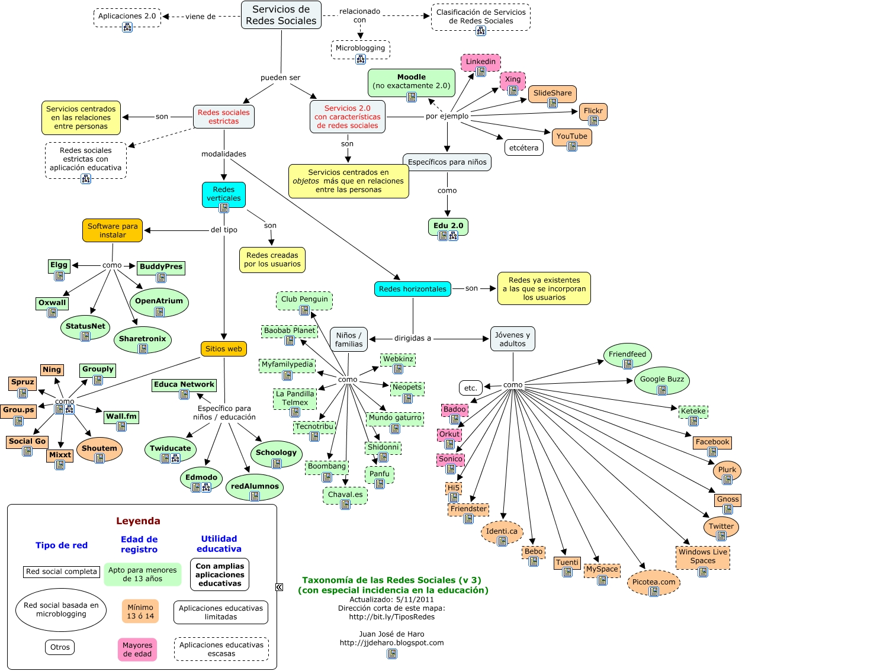

# U.3 CLASIFICACIÓN DE LAS REDES SOCIALES

  
La clasificación de los portales de Internet ha marcado la de las redes sociales en horizontales o generales y verticales o especializadas. 

**1\. Redes sociales horizontales**

Las redes sociales horizontales no tienen unos temas definidos, están dirigidas a un público general  y se centran en los contactos. Las más conocidas son:

[Facebook](http://www.facebook.com/): red social gratuita que está abierta a cualquier persona que tenga una cuenta de correo electrónico. Permite crear grupos y páginas, enviar regalos, y participar en juegos sociales. Es una de las más populares en España, especialmente entre los mayores de 25 años.

[Twitter](http://twitter.com/ "Twitter"): red social gratuita  que permite el envío y publicación de mensajes breves de texto. También permite seguir a otros usuarios.

[MySpace](http://es.myspace.com/): incluye blogs y espacios de entretenimiento social que permiten conocer el trabajo de otros usuarios, escuchar música y ver vídeos. Es muy utilizada por grupos musicales para compartir sus proyectos y crear grupos de seguidores.

**[Tuenti](http://www.tuenti.com/?m=login "Tuenti")**: red social española dirigida a la población joven. Se denomina a sí misma como una plataforma social de comunicación. 

**[Bebo](http://www.bebo.com/ "Bebo")**: esta red social permite crear tres tipos de perfiles: públicos, privados y totalmente privados, lo que la convierte en una opción de alta privacidad.

[Google+](https://plus.google.com/up/start/?continue=https://plus.google.com/?hl%3Des&type=st&gpcaz=191ab856&hl=es "Google+"): La red social de Google tiene unas características comunes a las demás. Para registrarse es necesario disponer de una cuenta Gmail. Es una de las más importantes en España por número de usuarios. Una de sus ventajas son las videoconferencias, que permiten conversaciones con hasta nueve usuarios simultáneamente.

### **2\. Redes sociales verticales**

Dentro de las redes sociales, hay una tendencia hacia la especialización. Aunque las redes sociales verticales ganan diariamente miles de usuarios, otras tantas especializadas se crean para dar cabida a los gustos e intereses de las personas que buscan un espacio de intercambio común. 

Véase [http://recursostic.educacion.es/observatorio/web/es/internet/web-20/1043-redes-sociales?start=3](http://recursostic.educacion.es/observatorio/web/es/internet/web-20/1043-redes-sociales?start=3)

En el  mapa conceptual del profesor[Juan José de Haro](http://jjdeharo.blogspot.com.es/ "Educativa"), _Redes sociales para la educación_(Madrid, Anaya Multimedia, 2010), se identifican la relación de las redes sociales con la Web 2.0, así como su multiplicidad y diversidad:

                   

**Crear grupos y páginas educativas en Twitter y Facebook**

 

           

  [http://www.emprendepyme.net/wp-content/uploads/2010/12/twitter-facebook.jpg](http://www.emprendepyme.net/wp-content/uploads/2010/12/twitter-facebook.jpg)

A veces, la mejor opción para acercar la educación a los alumnos es escoger los medios que más utilizan. La familiaridad y el uso cotidiano  que tienen Twitter o Facebook puede ayudarnos a compartir más fácilmente la información para vincular alumnos y recursos educativos y, desde luego, a los propios alumnos entre sí. Una parte importante del aprendizaje es la reciprocidad que se crea entre los estudiantes al compartir puntos de vista. La aportación que realiza cada uno de ellos es tan productiva y enriquecedora para el grupo como para ellos mismos, que aprenden a contribuir a un propósito puesto en común, y a exponer sus ideas a los demás. También podemos contar con estas páginas y grupos para compartir imágenes y vídeos que queremos que los alumnos conozcan, así como material educativo. 

La edad mínima de participación en estas redes es de 14 años y, de todas formas, al no ser cerradas es recomendable utilizar este tipo de redes a partir de esa edad. La elección entre una u otra la haremos en función de la actividad de nuestros alumnos, y del proyecto que queramos llevar a cabo. De igual manera, es conveniente considerar la posible aceptación de estos grupos o páginas por parte de los estudiantes. Dependiendo de su actitud y motivación podemos encontrarnos con una buena acogida de la iniciativa, o con el rechazo por considerarla una intromisión en su entorno personal. Para soslayar este posible obstáculo, lo más recomendable es partir de perfiles impersonales aunque con nombres reconocibles. En ambos servicios es necesario disponer de un perfil.

Véase **[http://recursostic.educacion.es/observatorio/web/es/internet/web-20/1043-redes-sociales?showall=1](http://recursostic.educacion.es/observatorio/web/es/internet/web-20/1043-redes-sociales?showall=1)**

