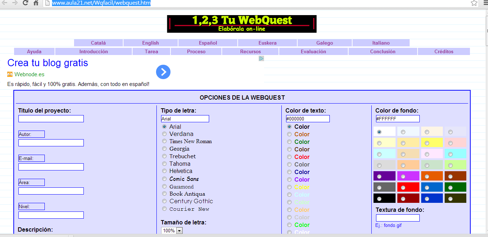

# U.3 ELABORACIÓN DE UNA WEBQUEST

Antes de comenzar a elaborar la  WebQuest y después de elegir un tema, hay que buscar los recursos adecuados en Internet, y formular las preguntas para crear un documento de WebQuest.

Según el tema de la WebQuest  no tendrían que visitar más de dos documento web, si son alumnos de Primer Ciclo de Primaria. Sin embargo, si son de Segundo Ciclo, o de Enseñanza Secundaria, puede ser oportuno que dispongan de un listado de webs que ellos deban visitar. Ellos escogerán el orden en el que consultarán los diferentes sitios y cómo gestionarán su búsqueda. En las WebQuest es tan importante el proceso como el resultado. En alumnos de Bachillerato es recomendable que sean ellos mismos los que elaboren la WebQuest.

La tarea simplificada puede consistir en un único recurso (página Web) y la obtención de datos fácilmente localizables, para que sea accesible para el alumnado. Es importante que el material tratado sea adecuado a su nivel académico e intereses. También es aconsejable dividir la investigación en áreas temáticas. De este modo el alumnado  pueden presentar oralmente sus resultados al resto de la clase sin que vayan repitiéndose de un grupo a otro. Esta estrategia, además, facilita la integración y la colaboración de todo el grupo.

<iframe src="//www.slideshare.net/slideshow/embed_code/key/taGbnFxT8Ve3kN" width="595" height="485" frameborder="0" marginwidth="0" marginheight="0" scrolling="no" style="border:1px solid #CCC; border-width:1px; margin-bottom:5px; max-width: 100%;" allowfullscreen> </iframe> 
 <strong> <a href="//www.slideshare.net/guest573009/prctica-n4-elaboracin-de-una-webquest-buena" title="Práctica nº4 elaboración de una webquest (buena)" target="_blank">Práctica nº4 elaboración de una webquest (buena)</a> </strong> from <strong><a href="https://www.slideshare.net/guest573009" target="_blank">guest573009</a></strong> 

**Recursos para crear WebQuest propias**

Muchas instituciones educativas, como es el caso de Aragón,  y Webs docentes, ponen a disposición del profesorado WebQuests ya creadas. No obstante, con un dominio de los motores de búsqueda de Internet – para la preselección de las Webs – puedes crear WebQuests propias con facilidad y en poco tiempo que dan un resultado óptimo.

Cada WebQuestse concreta en un documento WebQuest. Puedes desarrollar el documento de WebQuest en un sitio Web, un servicio de blog o incluso con un procesador de textos que pueda guardar archivos como una página web. Por grupos, los alumnos/as acceden al documento a través de la Web y siguen los pasos que indica. Presentan el resultado final a la clase.

Hay generadores de **WebQuest on-line** como el de **Aula21.net **([http://www.aula21.net/Wqfacil/webquest.htm](http://www.aula21.net/Wqfacil/webquest.htm)) que permiten crear los archivos de las páginas web que componen la WebQuest, para su posterior descarga, modificación en su caso, y alojamiento (por cuenta del usuario, ya que este servicio no se proporciona) en Internet.

