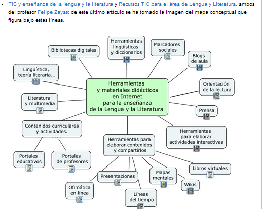

# U.3 TRABAJO COLABORATIVO CON WIKIS

# Usos educativos de los wikis

                Vídeo 7. [Wikis en la escuela](https://www.slideshare.net/dasava/wikis-en-la-escuela "Wikis en la escuela") de [dasava](http://www.slideshare.net/dasava)

Los wikis ofrecen interesantes posibilidades para todos los niveles del área de  Lengua Castellana y Literatura, ya que son imprescindibles para el trabajo cooperativo o colaborativo que suponga la creación de un documento común.  Algunos ejemplos son:

*   Contenidos teóricos de la materia.
*   Materiales instructivos y recursos para la realización de actividades didácticas en línea, especialmente enlaces y materiales accesibles a través de la web.
*   Repositorios textuales y antologías. Aunque el contenido más habitual de este tipo de repositorio sean los fragmentos textuales, también pueden crearse antologías fotográficas, de clips de audio y vídeo, y de otros recursos multimedia.
*   Guías de lectura; análisis y comentario de obras literarias y otros tipos de textos.
*   Documentos que exigen una planificación detallada y requieren una estructura analítica: resultados de proyectos de investigación, trabajos monográficos.

 Toda esta información y más la podemos encontrar en [http://propuestastic.elarequi.com/propuestas-didacticas/](http://propuestastic.elarequi.com/propuestas-didacticas/)

                                       Fig. 4.6 _Mapa conceptual de la importancia de las TIC para Lengua castellana y Literatura_

