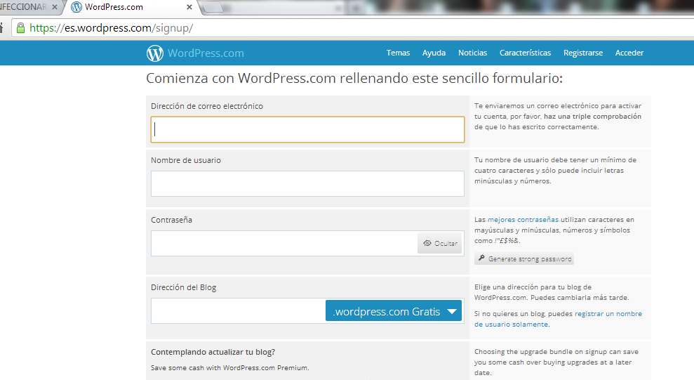
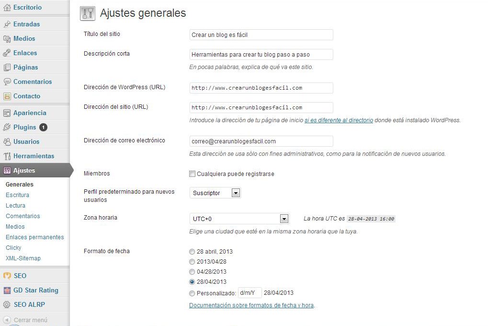

# U.4 CONFECCIONAR UN BLOG CON WORDPRESS

Otra posibilidad para crear un blog la ofrece WordPress. WordPress ha sido diseñado para ser instalado  en nuestro servidor web, es muy fácil de instalar y de  manejar. Para crear el blog hay que acceder a la página de [http://es.wordpress.com/](http://es.wordpress.com/)

**1\. Zona de acceso y creación de nuestro blog**

 Entra en la página [http://es.wordpress.com/](http://es.wordpress.com/)

*   **Selecciona “Registrarte Ahora”**

*   **Después de activar la cuenta puedes comenzar a administrar tu blog**. Para llegar al panel de administración accedes a [http://es.wordpress.com/](http://es.wordpress.com/) y allí entras con tu nombre de usuario y password.

*   **Selecciona un tema o una plantilla**

**2\. Opciones que hay que configurar antes de trabajar con el blog**

*   **Ajustes– Generales**

Las opciones generales incluyen aspectos como el título del blog, descripción corta, lenguaje, correo electrónico y configuración de fechas. Para configurar estas opciones sigue estos pasos:

**En el menú ve a Opciones—-General.**  
  
Te encuentras con la pantalla para configurar las opciones generales:

a. Título del Blog: es el nombre de tu blog que normalmente aparece en lo que se conoce como el "header". Si lo deseas puedes cambiar el título o dejarlo como está.

b. Descripción corta: es una breve descripción que aparece después del título de tu blog. Recomendamos que sustituyas ahora la que el blog trae por defecto e incluyas una descripción breve de tu blog. También, en vez de una descripción, puede ser un pensamiento que defina las metas de tu blog.

c. Lenguaje: aquí seleccionas el idioma principal de tu blog. Debe estar ya seleccionado el español.

d. Dirección de correo electrónico: aquí se incluye el correo del administrador del blog. Se utiliza solo con fines administrativos y no aparece disponible para tus visitantes.

e. Comentarios:  en esta sección puedes configurar todo lo relacionado a los comentarios. Por ejemplo, puedes optar por recibir un mensaje cada vez que alguien deja un mensaje en tu blog. Puedes optar también por moderar los comentarios. 

  

 Para continuar con la configuración de WorPress te recomendamos el siguiente tutorial: [http://tutorialwp.wordpress.com](http://tutorialwp.wordpress.com)

## Importante

Wordpress y Blogger son muy distintos, aunque tienen características en común. Wordpress, por ejemplo, no admite algunas etiquetas de HTML que son fundamentales para incrustar actividades interactivas, como es la etiqueta IFRAME. Pero, sin embargo, tiene un magnífico editor visual, gestor de imágenes y archivos. Se pueden incluir imágenes JPG, GIF y PNG,  vídeos, presentaciones PowerPoint y archivos de texto  en PDF, DOC, ODT. El lector puede descargar estos archivos de textos.

Te recomendamos el  tutorial  de cómo importar un blog de Blogger a WordPress:

[http://blogestores.wordpress.com/2007/02/07/importar-un-blog-de-blogger-a-wordpresscom/](http://blogestores.wordpress.com/2007/02/07/importar-un-blog-de-blogger-a-wordpresscom/)

