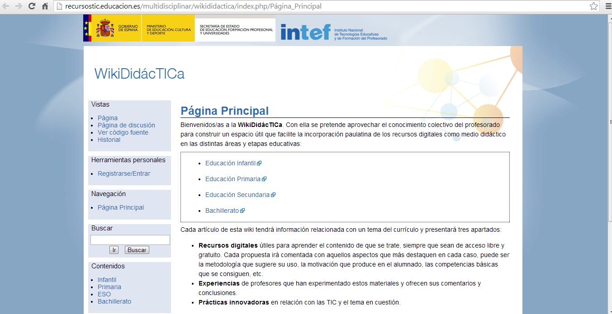

# U.4 EJEMPLOS DE WIKIS EDUCATIVOS DE LENGUA CASTELLANA Y LITERATURA

**Para todos los niveles **

*   _WikiDidácTICa_, [http://recursostic.educacion.es/multidisciplinar/wikididactica](http://recursostic.educacion.es/multidisciplinar/wikididactica/ "WikiDidácTICa"): magno proyecto auspiciado por el [INTEF](http://www.ite.educacion.es/es/intef "INTEF - Instituto Nacional de Tecnologías Educativas y de Formación del Profesorado"), que pretende “aprovechar el conocimiento colectivo del profesorado para construir un espacio útil que facilite la incorporación paulatina de los recursos digitales como medio didáctico en las distintas áreas y etapas educativas”. Aquí se pueden consultar los wikis correspondientes al área de [Lengua castellana y Literatura en Primaria](http://recursostic.educacion.es/multidisciplinar/wikididactica/index.php/Categor%C3%ADas_de_Lengua_castellana_y_literatura_en_Primaria) y los de [Lengua Castellana y Literatura en Secundaria](http://recursostic.educacion.es/multidisciplinar/wikididactica/index.php/Categor%C3%ADas_de_Lengua_castellana_y_literatura_en_la_ESO).

 

 

