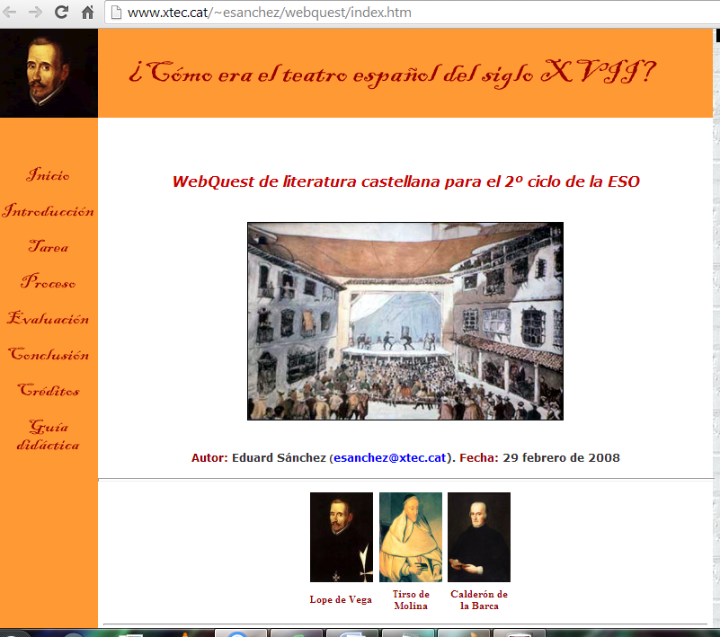

# U.5 DESARROLLO Y TIPOS DE WEBQUEST

Las WebQuests, siempre que promuevan procesos de enseñanza-aprendizaje significativos, pueden ser un recurso de gran eficacia didáctica en el área de Lengua Castellana y Literatura, pues tienen algunas ventajas indiscutibles:

*   Su facilidad de elaboración, la estructura fija de sus elementos, y la metodología de búsqueda y tratamiento de la información.

*   La gran variedad de tareas que permiten llevar a cabo  hace posible utilizarlas para el desarrollo de muy diferentes competencias, objetivos y contenidos.

*   El hecho de que habitualmente se publiquen en formato HTML, como páginas de un sitio web visible en Internet, permite que sean fácilmente utilizables por los alumnos y que otros docentes las puedan reutilizar o adaptar para sus propias necesidades.

 Se pueden distinguir tres tipos de WebQuest teniendo en cuenta los objetivos que en ellas se planteen:

*    A **corto plazo:** adquisición e integración del conocimiento de un determinado contenido de una o varias materias. Una WebQuest a corto plazo se diseña para ser terminado de uno a tres períodos de clase.

*   A **largo plazo:** implica mayor número de tareas, más profundas y elaboradas. Se diseña para que se realice en una semana  o  un mes de clase.

*   **Miniquest:** consiste en una versión reducida de las WebQuests, en las que solo se consideran tres pasos: escenario,  tarea y producto. Los alumnos las realizan completamente en el transcurso de una o dos clases como máximo.

                                                 Vídeo. 9 Tipos de webQuest [http://prezi.com/ypuz9jgu5pmp/webquest/](http://prezi.com/ypuz9jgu5pmp/webquest/)

En una webQuest se organiza a los alumnos/as en grupos. Se puede asignar a cada uno un papel determinado en el proceso de realización de la tarea conjunta.

La tarea se realiza en varias fases. Su duración puede ser variable, tanto en número de sesiones como en su distribución a lo largo del tiempo. Recomendamos llevar a cabo una WebQuest corta. Consiste en que los alumnos/as entren en contacto con determinada información general relacionada con un tema y la estructuren a partir de unos criterios o perspectivas.

Sin embargo, existen otras WebQuest largas en las que los alumnos/as amplían o profundizan en algún aspecto concreto de sus conocimientos, elaborando algún material o realizando nuevas aplicaciones de estos contenidos.

Fig. 5.11  _Ejemplo de WebQuest_ [http://www.xtec.cat/~esanchez/webquest/index.htm](http://www.xtec.cat/~esanchez/webquest/index.htm) 

